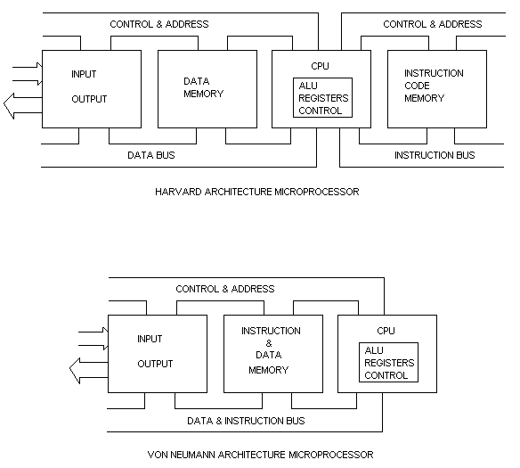
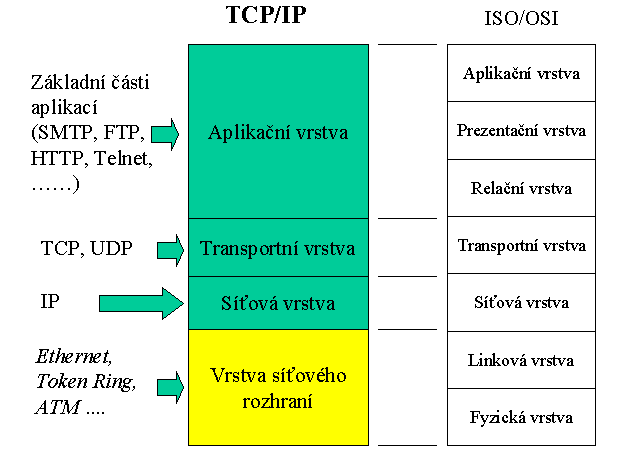
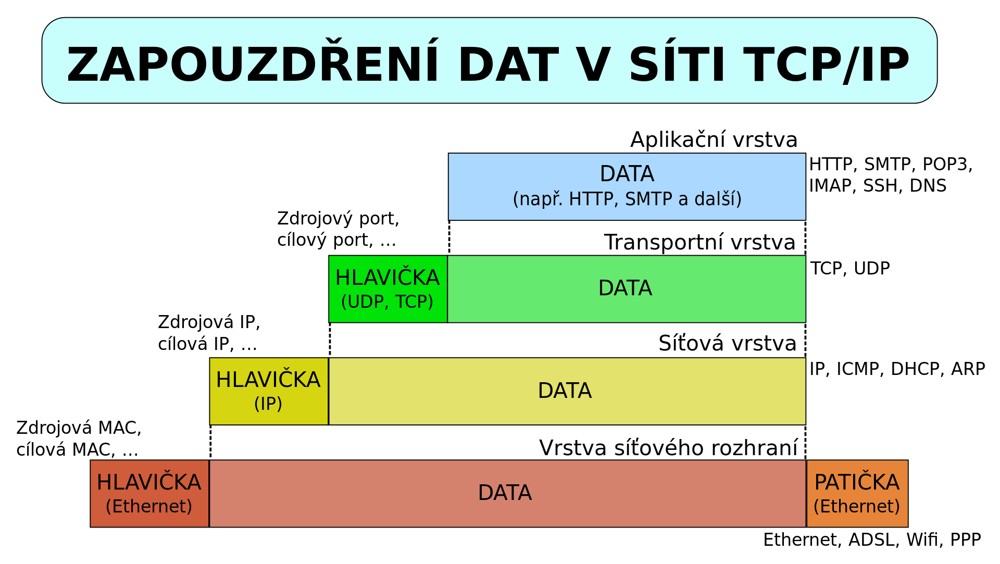

# Počítače a sítě


<!-- ----------------------------------------------------------------------------------------------------------------- -->
## 1. Architektura univerzálních procesorů. Principy urychlování činnosti procesorů.
Architektura procesoru je náčrt struktury a funkčnosti procesoru. Architektura mikroprocesoru je charakterizována výčtem registrů a jejich funkcí, vnitřních a vnějších sběrnic, způsobem adresování a instrukčním souborem.

Registr je malé uložiště dat v mikroprocesoru s rychlým přístupem, které slouží jako pracovní paměť během výpočtu.

Sběrnice je soustava vodičů pro přenos informací mezi více účastníky na principu jeden vysílá a ostatní přijímají. Sběrnice se podle přenášené informace dělí na datové, adresové a řídící.

**CISC** – počítač se složitým souborem instrukcí
- Bohatá instrukční sada, složené operace
- Instrukce mají proměnlivou délku i dobu vykonání
- Poměrně malý počet registrů – složitá instrukce může být rozdělena na více jednodušších instrukcí
- CISC procesory umí vykonat více operací na HW úrovni než RISC procesory, nemusí tedy umět více instrukcí

**RISC** – počítač s redukovaným souborem instrukcí
- Malý počet instrukcí, které dovolují všechny výpočty
- Instrukce vytvořeny pomocí obvodů, jednodušší výroba než CISC
- Širší sběrnice, rychlejší tok dat z a do procesoru
- Instrukce jsou prováděny jen nad registry
- Větší počet registrů
- Instrukce mají jednotný formát, délku
- S pamětí se komunikuje jen pomocí LOAD a STORE instrukcí
- V každém strojovém cyklu je dokončena 1 instrukce
- Používá se zřetězení zpracování instrukcí a řeší se problém s frontou instrukcí
- Mikroprocesorový řadič může být nahrazeny rychlejším obvodovým řadičem

**Zřetězené zpracování instrukcí (pipelining)**
- Na dosažení zřetězení je nutné rozdělit úlohu do posloupnosti dílčích úloh, z nichž každá může být vykonána samostatně
  - např. oddělit načítaní a ukládání dat z paměti od provádění výpočtu instrukce a tyto části pak mohou běžet souběžně.  
- To znamená že musíme osamostatnit jednotlivé části sekvenčního obvodu tak, aby každému obvodu odpovídala jedna fáze zpracování instrukcí. 
- Všechny fáze musí být stejně časově náročné, jinak je rychlost degradována na nejpomalejší z nich. 
- Fáze zpracování je rozdělena minimálně na 2 úseky: 
  1. načtení a dekódování instrukce
  2. provedení instrukce a případné uložení výsledku
- Zřetězení se stále vylepšuje a u novějších procesorů se již můžeme setkat stále s více řetězci rozpracovaných informací (více pipelines).
- Největší problém spočívá v plnění zřetězené jednotky, hlavně při provádění podmíněných skoků, kdy během stejného počtu cyklů se vykoná více instrukcí.
- U pipelingu se instrukce následující po skoku vyzvedává dřív než je skok dokončen. 
- Primitivní implementace vyzvedává vždy následující instrukci, což vede k tomu že se vždy mýlí, pokud je skok nepodmíněný. 
- Pozdější implementace mají jednotku předpovídání skoku (1 bit), která vždy správně předpoví nepodmíněný skok a s použitím cache se záznamem předchozího chování programu se pokusí předpovědět i cíl podmíněných skoků nebo skoků s adresou v registru nebo paměti.
- V případě, že se predikce nepovede, bývá nutné vyprázdnit celou pipeline a začít vyzvedávat instrukce ze správné adresy, což znamená relativně velké zdržení
- Souvisejícím problémem je přerušení.

**Plnění fronty instrukcí**
- Pokud se dokončí skoková instrukce, která odkazuje na jinou část kódu musejí být instrukce za ní zahozeny (problém plnění fronty intrukcí). 
- U malého zřetězení neřešíme.
- Používání bublin na vyprázdnění pipeline, naplnění prázdnými instrukcemi. 
- Predikce skoku - vyhrazen jeden bit předurčující, zda se skok provede či nikoliv.
  - Statická predikce - součást instrukce, řeší programátor. 
  - Dynamická predikce je buď jedno nebo dvou bitová. 
    - Jednobitová skok se provedl 1, nebo neprovedl 0. 
    - Dvoubitová, metoda zpožděného skoku, v procesure se řeší např. tabulkou s 4kB instrukcí.
- Superskalární architektura (zdvojení) když nastane podmíněný skok, začnou se vykonávat instrukce obou variant, nepotřebná část se pak zahodí. Tento způsob, pak vyžaduje vyřešit ukládání výsledku.

### Von Neumanova architektura
- John Von Neumann definoval v roce 1945 základní koncepci počítače (EDVAC) řízeného obsahem paměti. 
- počítače se v podstatě v dnešní době konstruují podle tohoto modelu. 
- Počítač musí splňovat tyto kritéria aby byl univerzální:
  - Počítač se skládá z paměti, řídící jednotky, aritmeticko-logické jednotky (ALU), vstupní a výstupní jednotky.
  - Struktura PC je nezávislá na typu řešené úlohy (univerzálnost), počítač se programuje obsahem paměti.
  - Následující krok počítače je závislý na kroku předešlém.
  - Instrukce a data jsou v téže paměti.
  - Paměť je rozdělena do paměťových buněk stejné velikosti (Byte), jejichž pořadová čísla se využívají jako adresy.
  - Program je tvořen posloupností instrukcí, které se vykonávají jednotlivě v pořadí, v jakém jsou zapsány do paměti.
  - Změna pořadí prováděných instrukcí se provádí skokovými instrukcemi (podmíněné nebo nepodmíněné skoky na adresu)  
  - Čísla, instrukce, adresy a znaky se značí ve dvojkové soustavě
- Nevýhody této architektury: 
  - Podle von Neumannova schématu počítač pracuje vždy nad jedním programem. Toto vede k velmi špatnému využití strojového času. Dnes je využíváno paralelizmu.
  - Počítač může mít i více jak jeden procesor. 
  - Podle Von Neumanova schématu mohl počítač pracovat pouze v tzv. diskrétním režimu, kdy byl do paměti počítače zaveden program, data a pak probíhal výpočet. V průběhu výpočtu již nebylo možné s počítačem dále interaktivně komunikovat. 
  - Dnes existují vstupní/ výstupní zařízení, např. pevné disky a páskové mechaniky, které umožňují vstup i výstup. Program se do paměti nemusí zavést celý, ale je možné zavést pouze jeho část a ostatní části zavádět až v případě potřeby.



- ALU - aritmetickologická jednotka - jednotka provádějící veškeré aritmetické výpočty a logické operace. Obsahuje sčítačky, násobičky a komparátory.
- Operační paměť - slouží k uchování zpracovávaného programu, zpracovávaných dat a výsledků výpočtu
- Řídící jednotka - řídí činnost všech částí počítače. Toto řízení je prováděno pomocí řídících signálů, které jsou zasílány jednotlivým modulům. Dnes řadič spolu s ALU tvoří jednu součástku, a to procesor.
- Vstup/ Výstup - zařízení určené pro vstup dat, a výstup zpracovaných výsledků


### Harvardská architektura
- Oproti Von Neumanové koncepci rozděluje paměť pro data a program. Což má výhody: 
  - nedojde k přepsání programu
  - paralelní načítání dat a instrukcí přes dvě sběrnice
  - Obě paměti mohou být vyrobeny jiným způsobem, mít jinou velikost i jinou nejmenší adresovací jednotku. 
- Ale i nevýhody: 
  - dražší výroba
  - složitější režie dvou sběrnic
  - nemožnost využití nevyužité paměti druhým typem obsahu.
- Základním nedostatkem obou koncepcí je sekvenční vykonávání instrukcí, které sice umožňuje snadnou implementaci systému, ale nepovoluje paralelní zpracování. 
  - Paralelizmy se musí simulovat až na úrovni operačního systému pomocí multitaskingu. 
  - Sběrnice nedovolují přistupovat do více míst paměti současně a navíc dovolují v daném okamžiku přenos dat jen jedním směrem.


<!-- ----------------------------------------------------------------------------------------------------------------- -->
## 2. Základní vlastnosti monolitických počítačů a jejich typické integrované periférie. Možnosti použití.
- Mikroprocesory, mikrokontroléry, minipočítače to jsou další názvy pro monolitické počítače.
- Jsou to malé počítače integrované v jediném pouzdře (all in one), mají širokou oblast využití. 
- Využívají Harvardské koncepce, což umožňuje aplikovat paměti pro data a program různých technologií.
- Zjednodušené rysy architektury RISC (INTEL 8051 (standart), ATMEL, MICROCHIP PIC). 
- Pro data se většinou využívá RWM-RAM paměť s libovolným přístupem, vyráběny jako statické a paměťové bunky jsou realizovány pomocí klopných obvodů
- Program je uložen v paměti, která si zachovává svůj obsah, nejčastěji EPROM, EEPROM nebo Flash
- Zdroje synchronizace:
  - krystal (křemenový výbrus) - drahé ale přesné
  - keramický rezonátor
  - obvod RC - snadno integrovatelný
  - obvod LC
- Ochrana proti rušení je většinou mechanická, proti nárazům a vibracím
  - dále existují speciální obvody WATCHDOG - reset mikropočítače, BROWN-OUT ochrana proti podpětí
- Typické periférie:
- **Vstupní a výstupní brány**
  - Nejjednodušší a nejčastěji používané rozhraní pro vstup a výstup informací je u mikropočítačů paralelní brána - port. 
  - Bývá obvykle organizována jako 4 nebo 8 jednobitové vývody, kde lze současně zapisovat i číst logické informace (0 a 1). 
  - U většiny bran lze jednotlivě nastavit, které bitové vývody budou sloužit jako vstupní a které jako výstupní. 
  - Na vstupu je Schmittův klopný obvod. 
  - U mnoha mikropočítačů jsou brány implementovány tak, že s nimi instrukční soubor může pracovat jako s množinou vývodu, nebo jako s jednotlivými bity.
- **Čítače a časovače**
  - Časoveč je inkrementován vnitřním hodinovým signálem používaným pro řízení samotného mikropočítače
  - Čítač je inkrementován vnějším signálem
  - Lze tak podle přesnosti zdroje hodinového signálu zajistit řízení událostí a chování v reálném čase. 
  - Při přetečení časovače se i zde může automaticky předávat signál do přerušovacího podsystému mikropočítače.
- **Sériové linky**
  - Sériový přenos dat je v praxi stále více používán. Dovoluje efektivním způsobem přenášet data na relativně velké vzdálenosti při použití minimálního počtu vodičů. 
  - Hlavní nevýhodou je však nižší přenosová rychlost, a to že se data musí kódovat a dekódovat.
- **A/D a D/A převodníky**
  - Fyzikální veličiny, které vstupují do mikropočítače, jsou většinou reprezentovány analogovou formou (napětím, proudem, nebo odporem). 
  - Pro zpracování počítačem však potřebujeme informaci v digitální (číselné) formě. K tomuto účelu slouží analogově–číslicové převodníky.

**Střadačové (pracovní) registry**
- ve struktuře procesoru jsou obvykle 1-8-16 základních pracovních registrů, jsou nejpoužívanější. 
- Ukládají se do nich aktuálně zpracovávaná data a jsou nejčastějším operandem strojových instrukcí.
- také se do nich nejčastěji ukládají výsledky operací. Nejsou určeny pro dlouhodobé ukládání dat.


**Univerzální zápisníkové registry**
- jsou jich desítky až stovky. Slouží pro ukládání nejčastěji používaných dat. 
- Instrukční soubor obvykle dovoluje, aby se část strojových instrukcí prováděla přímo s těmito registry. 
- Formát strojových instrukcí obvykle nedovoluje adresovat velký rozsah registru, proto se implementuje několik stejných skupin registru vedle sebe, s možností mezi skupinami přepínat - registrové banky.


**Pamět dat RWM**
- slouží pro ukládání rozsáhlejších nebo méně používaných dat (z těch předešlých nejméně používaný). 
- Instrukční soubor obvykle nedovoluje s obsahem této paměti přímo manipulovat, kromě instrukcí přesunových. Těmi se data přesunou např. do pracovního registru. 
- Některé procesory dovolují, aby data z této paměti byla použita jako druhý operand strojové instrukce, výsledek ale nelze zpět do této paměti uložit přímo.

<!-- ----------------------------------------------------------------------------------------------------------------- -->
## 3. Struktura OS a jeho návaznost na technické vybavení počítače.
Hlavní úkoly OS:
- Organizuje přístup a zdroje počítače (procesorový čas, přístup k datům a do paměti)
- Fyzicky zajištuji čtení a zápis dat
- Komunikuje s uživatelem a na základě jeho pokynů vykonává jeho akce
- Reaguje na chybové stavy programů, tak aby nedošlo k poškození dat nebo pádu celého systému
- Spravuje komunikaci s perifériemi
- Eviduje využívání systémových zdrojů

OS je většinou tvořen těmito součásti:
- Jádro-Kernel – po zavedení OS do paměti řídí činnost počítače, poskytuje procesům procesorový čas a řeší správu prostředků
- Ovladače – podprogramy pro ovládání zařízení standardním způsobem
- Příkazový procesor – program, který umožňuje řídit OS a programy pomocí textové konzole
- Podpůrné programy – překladače a další programy

Jádro OS se obvykle stará o dvě hlavní věci.
Správa procesů řeší problematiku aktivování a deaktivování procesů podle jejich priority, resp. požadavků na prostředky. (Multitasking) Správa prostředků zajišťuje činnost V/V zařízení, přiděluje paměť, procesory. Spadá zde i správa přístupu do souborového systému. V OS Linux jsou zařízení soubory.

- Proces
  - Je instance programu vykonávána na jednom nebo více jádrech CPU
  - Potřebuje pro svůj běh zdroje, které mu přidělí daný OS
  - OS vytváří, ručí a pozastavuje procesy
- Správa procesoru
  - OS řeší, co kde běží a za jaké frekvence
  - Plánování vláken
- Správa vnitřní paměti
  - Operační paměť RAM, jejíž obsah je k dispozici jen za běhu
  - OS řídí, kdo využívá, jakou paměť a kolik jí využívá
  - OS se stará o přidělování a uvolňování paměti
  - Virtuální paměť – swappování na disk
  - OS kontroluje přístupy do paměti mimo dovolený prostor
- Správa IO
  - Poskytuje vyrovnávací paměti, buffery
- Správa souborového systému
  - pojmenovaná sada dat uložená na nějakém datovém médiu, se kterou lze pracovat nástroji operačního systému jako s jedním celkem.
  - Různé souborové systémy
    - Ext2, ext3, ext4
    - FAT, exFAT, NTFS
- Někdy je součástí OS i antivirový program, jako je tomu u OS Windows
- Součástí OS je i logika přístupu k chráněným souborům a funkcím
  - OS řídí, kdo má přístup, k jakým datům a souborům

**Struktura OS podle jádra**
- Monolitický OS –jádro je na jednom místě, aplikace jsou odděleny od OS a komunikují s OS pomocí systémových volání
- Otevřené systémy – aplikaci i jádro v jednom adresním prostoru
- MicroKernelOS – minimální chráněné jádro, ostatní OS věci běží v adresním prostoru aplikací


<!-- ----------------------------------------------------------------------------------------------------------------- -->
## 4. Protokolová rodina TCP/IP.




### Model ISO/OSI (*added*)
- ISO vypracoval referenční model OSI (Open Systems Interconnection), který rozdělil práci v síti do 7 vzájemně spolupracujících vrstev.
- Princip spočívá v tom, že vyšší vrstva převezme úkol od podřízené vrstvy, zpracuje jej a předá vrstvě nadřízené. 
- Vertikální spolupráce mezi vrstvami (nadřízená s podřízenou) je v režii výrobce sítě. 
- Model ISO/OSI doporučuje jak mají vrstvy spolupracovat horizontálně – dvě stejné vrstvy modelu mezi různými sítěmi (či síťové prvky různých výrobců) musejí spolupracovat.
1. Fyzická vrstva - Popisuje elektrické (či optické), mechanické a funkční vlastnosti: jakým signálem je reprezentována logická jednička, jak přijímací stanice rozezná začátek bitu, jaký je tvar konektoru, k čemu je který vodič v kabelu použit
2. Spojová vrstva - Uskutečňuje přenos údajů (datových rámců) po fyzickém médiu, pracuje s fyzickými vrstva adresami síťových karet, odesílá a přijímá rámce, kontroluje cílové adresy každého přijatého rámce, určuje, zda bude rámec odevzdán vyšší vrstvě.
3. Síťová vrstva - Je zodpovědná za spojení a směrování mezi dvěma počítači nebo celými sítěmi, mezi nimiž neexistuje přímé spojení. Zajišťuje volbu trasy při spojení (routing).
4. Transportní vrstva - Typickou činností transportní vrstvy je dělení přenášené zprávy na pakety a opětovné skládání přijatých paketů do zpráv (při přenosu se mohou pakety pomíchat či ztratit).
5. Relační vrstva - Navazuje a po skončení přenosu ukončuje spojení. Může provádět ověřování uživatelů, zabezpečení přístupu k zařízením
6. Prezentační vrstva - Má na starosti konverzi dat, přenášená data mohou totiž být v různých sítích různě kódována. Tato vrstva zajišťuje sjednocení formy vzájemně přenášených údajů. Dále data komprimuje, případně šifruje. V praxi často splývá s relační vrstvou.
7. Aplikační vrstva - Je určitou aplikací zpřístupňující uživatelům síťové služby. Nabízí a zajišťuje přístup ke vzdáleným souborům, vzdálený přístup k tiskárnám, správu sítě, e-maily

### Protokol TCP/IP
Tato skupina protokolů je dnes určitě nejrozšířenější. Původně byla navržena pro síť z níž se vyvinul Internet.

Spolupráce vrstev probíhá asi takto: K navázáni spojení použije program aplikační vrstvu, od níž putuje požadavek na spojení do transportní vrstvy. Ta zorganizuje dopravu dat (data rozdělí na segmenty, naváže spojení, zkontroluje, zda byla data doručena). Vlastní přenos zajišťuje nižší -- síťová vrstva. Segmenty, které obdržela od nadřazené vrstvy, "zabalí" do datagramů a doručí vzdálenému počítač

**Aplikační vrstva**
- je tvořena množinou protokolů spolupracujících s jednotlivými aplikačními programy. Aplikačních protokolů je mnoho, např:
- HTTP - internetový protokol určený pro výměnu hypertextových dokumentů ve formátu HTML
- SMTP - Přenos emailových zpráv mezi přepravci elektronické pošty MTA (message transfer agent), zajišťuje přímé spojení mezi odesílatelem a adresátem
- IMAP, POP3 - protokoly umožňující vyzvednutí elektronické pošty ze schránky
  - POP3 pouze stahuje poštu
  - IMAP dovoluje stahovat samotné hlavičky a manipulaci se schránkou
- FTP - pro přenos souborů mezi počítači (TCP, port 20 k přenosu, port 21 k řízení), jednoduší varianta TFTP (UDP)
- Telnet - Klient-server protokol, jednoduchá terminálové relace
- SSH - protokol pro zabezpečenou šifrovanou komunikaci, náhrada za Telnet
- DNS - Mapování jmen počítačů na IP adresy a naopak.

**Transportní vrstva** 
- jádro TCP/IP, jeden ze dvou protokolů, TCP nebo UDP.
- Protokol TCP
  - Od aplikační vrstvy přebere data, která rozdělí na segmenty, očísluje a seřadí podle toho, jak mají být postupně odeslány. 
  - Před začátkem výměny dat zahájí relaci s transportní vrstvou protějšího počítače. 
  - Poté začne s vysíláním a potvrzováním jednotlivých datových segmentů. 
  - Vlastní odesílání je již věcí síťové vrstvy, což je popsáno dále. 
  - (Vše funguje také opačně: Od síťové vrstvy jsou přebrány datové segmenty, které TCP setřídí. Pokud některý chybí, tak si jej znovu vyžádá. Ze segmentů složí data a předá je prostřednictvím aplikačního protokolu některému z programů).
- Protokol UDP
  - UDP nepotřebuje vytvářet před přenosem dat relaci s protějškem a nekontroluje zda byly datagramy protějškem přijaty
  - Protokol UDP je jednodušší, ale méně spolehlivý. 
  - Některé programy jej využívají místo protokolu TCP pro rychlý přenos, kde doručení každého paketu není podmínkou (stream videa, stream zvuku, atd.).

**Síťová vrstva - Protokol IP**
- Od nadřazených protokolů transportní vrstvy obdrží datové segmenty s požadavkem na odeslání. 
- K segmentům připojí vlastní hlavičku a vytvoří IP datagram. 
- V IP hlavičce je především IP adresa příjemce a odesílatele
- hlavním úkolem je doručení jednotlivých datagramů k příjemci
- provádí tedy adresování a směrování datagramů mezi počítači. 
- IP protokol je nespojový (před zahájením výměny dat nevytváří relaci) a nespolehlivý (předání paketů na místo určení není kontrolováno). 
- Paket IP se tedy může ztratit, být doručen mimo pořadí, zdvojen nebo zpožděn. 
- Protokol IP neobsahuje prostředky pro zotavení z chyb tohoto typu. To vše má zajistit nadřízená transportní vrstva - protokol TCP
- Dále:
  - ICMP (internet control message protocol) - slouží pro odesílání služebních a chybových zpráv, PING
  - ARP (Adress Resolution Protool) - Převod z IP na MAC
  - DHCP - automatické přidělování IP adres v síti.

### Ethernet
- Ethernet je souhrnný název pro v současné době nejrozšířenější technologie pro budování počítačových sítí typu LAN
- Ethernet se stal *de-facto* standardem pro svoji jednoduchost a nízkou cenu a vytlačil z trhu ostatní alternativní technologie (např. ARCNET, ATM, FDDI). 
- Ethernetová rámec obsahuje hlavně preambuli, zdrojovou a cílovou MAC adresu a kontrolního součet. 
- Používá se CSMA/CD metoda detekce kolizí. 
  - Stanice naslouchá, pokud je médium volné začne vysílat. 
  - Pokud začnou vysílat zároveň dvě stanice, vznikne kolize, pak se stanice odmlčí a znovu se pokoušejí vysílat. 
  - Mezi opakovanými pokusy a vysílání je náhodná prodleva.
- Přenosová média jsou koaxiální kabel, kroucená dvojlinka UTP či optické vlákno (jedno/dvou vidové). 

### IPv6
- IPv6 přináší zejména masivní rozšíření adresního prostoru adres a zdokonalení schopnosti přenášet vysokorychlostně data. 
- Každá adresa má 128 bitů. Odstraněna potřeba NAT. 
- Protokol pro IP vrstvu šifrování a autentizaci IPsec je integrální součástí souboru protokolů IPv6, na rozdíl od IPv4, kde je přítomen volitelně. 

<!-- ----------------------------------------------------------------------------------------------------------------- -->
## 5. Metody sdíleného přístupu ke společnému kanálu.
Metody sdíleného přístupu ke společnému kanálu se dělí na dvě skupiny
1. Nedeterministické kolizní metody - algoritmy časo založené na náhodě (náhodné časové prodlevy), může dojít ke kolizím, které se musí řešit
   - kolize je situace, kdy chce jeden přenosový kanál využívat více stanic
2. Deterministické bezkolizní metody - řídí algoritmy, které přesně určují, kdo dostane přístup na přenosový kanál, nedochází ke kolizím

### Nedeterministické kolizní metody
- Více stanic může přistupovat současně na sdílené médium, možnost kolize, která je třeba řešit. 
- Algoritmy řešení kolize:
  - kolizní slot - udává kolik času se ztratí nevyužitím kanálu vlivem řešení kolize
  - aloha - vhodné pro kanál s řídkým provozem, netestuje se obsazenost, rovnou se vysílá, pokud nepříjde do limitu potvrzení tak se vysílání opakuje. Kolizní slot=dvojnásobek délky vysílání rámce
  - taktovaná aloha - vysílací čas je rozdělen na časy, ve kterých se smí začít vysílat. Poloviční kolizní slot, neboť nemůže nastat situace, kdy jedna stanice začne vysílat ve chvíli, kdy skoro skončila druhá stanice vysílat
  - řízená aloha - řídí intenzitu opakování dle zatížení sítě, zatížěnější síť -> delší interval opakování
  - CSMA/CD - Před odeslaním rámce se testuje stav kanálu, je-li kanál odesílání se odloží. Kolize může nastat když více stanic začne vysílat při uvolnění média. Při detekci kolize se vyšle *jam* signál, která oznámi všem, že musí okamžitě přestat vysílat a počkat náhodnou dobu než začnou vysílat znova.


### Deterministické bezkolizní metody
- Je definován jednoznačný algoritmus, určující v jakém stanice mohou stanice přistupovat na sdílené médium, nemůže dojít ke kolizi, protože nikdy nepřistoupí více než jedna stanice na médium současně. 
- Algoritmy: Token passing, centralizované řízení (pooling), distribuované řízení, rezervační rámec, binární vyhledávání a logický kruh.
- **Token passing**
  - Mezi stanicemi cyklicky putuje rámec token (vysílací právo). Pouze stanice s tímto tokenem může začít vysílat. Metoda se buďto váže k fyzickému kruhu nebo sběrnici
  - Každá stanice dostane toto právě do nějakého časového limitu. 
  - Vhodné pro řízení technologických procesů.
- **Centralizované řízení**
  - Přidělování na výzvu,
    - stanice smí vysílat když je k tomu vyzvána řídícím prvkem (master). 
    - Tato výzva je buď cyklická (stanice zašle data nebo neodpoví) nebo používá binární vyhledávání ve stromové struktuře.
  - Přidělování na žádost
    - stanice žádají řídící prvek o právo vysílat, podobně CSMA/CA
- **Distribuované řízení - rezervační rámec**
  - Řídící stanice periodicky generuje rezervační rámec, každá stanice má svůj slot, ve kterém si může zažádat o přidělení vysílacího práva. 
  - Datové sloty následují za rezervačním rámcem.


<!-- ----------------------------------------------------------------------------------------------------------------- -->
## 6. Problémy směrování v počítačových sítích. Adresování v IP, překlad adres (NAT).

### Směrování v lokálních sítích
- HUB pošle to co mu příjde na všechny ostatní porty
- SWITCH (2. vrstva OSI) - smšruje podle tabulky adres, pouze v lokálí sítí
  - Spanning Tree protokol - graf sítě bez cyklů, switch nepouživá ty porty, které vedou ke smyčkám. Nepuživané porty jsou záložní

### Směrování v internetu
- Směrování je určování cesty datagramu (paketu) v prostředí počítačových sítí. 
- Směrování zajišťují hlavně routery (3. vrstva OSI), ale i koncové stanice. 
- Cílem je doručit datagram (paket) adresátovi, po co nejefektivnější cestě. 
- Směrování zajišťuje síťová vrstva modelu ISO/OSI a je využíváno v lokálních sítích LAN i na Internetu, kde jsou dnes směrovány zejména IP datagramy. 
- Síťová infrastruktura mezi odesílatelem a adresátem paketu může být velmi složitá, a proto se směrování zpravidla nezabývá celou cestou paketu, ale řeší vždy jen jeden krok, tj. komu datagram předat jako dalšímu. 
- Ke směrování jsou třeba směrovací tabulky, ty se dají naplnit staticky (ručně), použitelné jen pro malé sítě, nebo dynamicky, pro sítě s měnící se infrastrukturou. 
- Kvůli velikosti internetu se řeší směrování hierarchicky. Internet je rozdělen do tzv. autonomních systémů (AS). 
- AS je skupina sítí a směrovačů, které jsou pod společnou správou a řídí se společnou směrovací politikou, tj. používají jeden směrovací protokol, ale také speciální požadavky administrátorů na směrování některých druhů provozu (traffic engineering, load balancing). 
- Příkladem autonomního systému tak může být autonomní systém jednoho konkrétního poskytovatele Internetu (ISP) nebo velké firmy.
- Cílem hierarchického směrování je vždy nejprve doručit paket určený pro některou ze sítí autonomního systému na hranice tohoto autonomního systému. 
- O další směrování ke konkrétní síti uvnitř AS se již postará vnitřní směrovací protokol, který zná topologii (nebo alepoň cesty ke všem  sítím) svého vlastního AS. 
- Směrovač, který je na hranici autonomního systému a účastní se jak na směrování mezi AS tak ve směrovacím protokolu svého AS, se nazývá hraniční směrovač.
- Při směrování v rámci jednotlivých AS se používají tzv. vnitřní směrovací  protokoly - *Interior Gateway Protocols*, IGP. 
- Naopak pro směrování mezi autonomními systémy se používají vnější směrovací protokoly - *Exterior Gateway Protocols*, EGP. 
- Typickými vnitřními směrovacími protokoly jsou dnes např. OSPF nebo starší RIP, jako vnější směrovací protokol se používá téměř výhradně protokol BGP.
- Směrovací algoritmy se děli na DVA - Distance vector algoritmy a Link state algoritmy.

**Statické směrování**
- Směrovací tabulky v jednotlivých routerech konfigurovány ručně, odpadá režie směrovacích protokolů. 
- Tento způsob je bezpečnější (omezení možnosti generování falešných směrovacích informací, odposlouchávání topologie). 
- Při výpadku nutný ruční zásah a manuální oprava. 
- Použití v malých sítích, např, intranety.

**Dynamické směrování**
- Automaticky reaguje na změny v sítí
- Méně bezpečně, ale hodí se pro velké sítě. 
- Musí být provozovány směrovací protokoly. 
- V praxi se většinou použijí oba typy směrování zároveň a staticky nadefinované cesty mají přednost.


### Distance vector algorithm
- Sousední routery si navzájem vyměňují své směrovací tabulky a doplňují si informace, které se naučí od sousedů
- Routery neznají topologii celé sítě, musí se spokojit s adresami sousedů, přes která posílají pakety do jednotlivých cílových sítí
- Routery znají vzdálenostmi k těmto sousedům, adresa a vzdálenost souseda tvoří distanční vektor. 
- Na začátku směrovací tabulka obsahuje pouze přímo připojené sítě, staticky nakonfigurováno administrátorem.
- Celá směrovací tabulka je periodicky zasílána sousedům
- Z příchozích směrovacích tabulek si router postupně upravuje svou vlastní směrovací tabulku
- Pokud cesta nebyla delší dobu sousedem inzerována tak se ze směrovací tabulky se odstraní. 
- Metrikou je počet přeskoků na cestě mezi zdrojem a cílem, tedy nezohledňuje zatížení linek. 
- Nevýhodou je pomalá konvergence při změně topologie, změna nastává až při nějakém broadcastu tabulek sousedů. 
- Další nevýhodou je broadcast celých tabulek.
- RIP - *Routing Information Protocol* - starý, stále používaný v malých sítích. Max. 16 přeskoků.
- IGRP - *Interior Gateway Routing Protocol* - od Cisca, kromě počtu přeskoků zohledňuje zpoždění, propustnosti, spolehlivost. Max. 255 přeskoků.

### Link state
- Směrovače znají topologii celé sítě (cenu a funkčnost jednotlivých linek), tyto informace mají uložené v topologické databázi. 
- Směrování probíhá tedy na základě stavu jednotlivých linek. 
- Nejkratší cesta se počítá pomocí Dijkstrova algoritmu. 
- Každý router neustále kontroluje stav připojených linek, testuje připojené sousedy (Hello protocol). 
- Při změně okamžitě šíří tuto informaci všem ostatním směrovačům, které si ji uloží do topologické databáze, rychlá konvergence. 
- Příkladem je \textbf{OSPF}.
- Nevýhodou je že směrovač musí znát topologii celé sítě.
  - Jedno z vylepšeních rozděluje síť na menší oblasti

### Adresování v IP
- IP adresa je logická adresa zařízení v počítačové síti (na 3. vrstvě podle OSI modelu), která používá IP protokol. 
- V IP v4 je tato adresa velká 32bitů (4 byte) a zapisuje se pomocí čtyř dekadických hodnot (každá velká jeden byte), označovaných jako oktet, oddělených tečkou. 
- IP adresa může nabývat hodnot 0.0.0.0 až 255.255.255.255 (teoreticky, ne všechny adresy je možno v praxi použít), což je adresní rozsah IP sítí a internetu. 
- Rozsah můžeme rozdělit na menší části, subnety. Síťová zařízení uvnitř subnetu sdílí společný prefix IP adresy.
- IP adresa se skládá z několika částí. V základu jde o dvě části, prefix identifikující síť a adresa uzlu v rámci podsítě. 
- U původních classful sítí byl prefix pevně dán třídou, do které adresa patřila. 
- U dnešních classless sítí můžeme prefix určit z masky podsítě. Nebo adresu rozdělit na tři části, adresu sítě, adresu podsítě a adresu uzlu. Kde adresa sítě je dána třídou IP adresy a adresa podsítě je rozdíl masky a třídy.
```
classful   <network-prefix><-------host-number-------->
classless  <network-number><subnet-number><host-number>
classless  <-------network-prefix--------><host-number>
```
- maska podsítě se používá pro to, abychom určily, která část IP adresy je pro podsíť a která pro uzel
- Adresu sítě přiděluje oblastní správce, pro EU RIPE
- typy IP adres:
  - Unicast - adresa konkrétního PC
  - Multicast - adresa na více PC najednou
  - Broadcast - adresa na všechny počítače v jednom segmentu, 255.255.255.255
  - Loopback - smyčka 127.0.0.1

### NAT
- NAT přeloží adresy z lokální sítě na jedinečnou adresu, která slouží pro vstup do jiné sítě (např. Internetu)
- Překládanou adresu si uloží do tabulky pod náhodným portem, při odpovědi si v tabulce vyhledá port a pošle pakety na IP adresu přiřazenou k danému portu. 
- NAT je vlastně jednoduchým proxy serverem. 
- NAT může být softwarového typu (Nat32, Kerio Winroute firewall), nebo hardwarového typu (router s implementací NAT). 
- Překlady buď staticky (ručně) nebo dynamicky (Adresy se vybírají z poolu adres).
- Vlastní Komunikace: 
  - Klient odešle požadavek na komunikaci, směrovač se podívá do tabulky a zjistí, zdali se jedná o adresu lokální, nebo adresu venkovní. V případě venkovní adresy si do tabulky uloží číslo náhodného portu, pod kterým bude vysílat a k němu si přiřadí IP adresu.


<!-- ----------------------------------------------------------------------------------------------------------------- -->
## 7. Bezpečnost počítačových sítí s TCP/IP: útoky, paketové filtry, stavový firewall. Šifrování a autentizace, virtuální privátní sítě.
Základní pojmy:
- Utajení (confidentality) - posluchač na kanále datům nerozumí
- Autentizace (authentication) - jistota, že odesílatel je tím, za koho se vydává 
- Integrita (integrity) - jistota, že data nebyla na cestě modifikována 
- Nepopiratelnost (non-repudiation) - zdroj dat nemůže popřít jejich odeslání

**DoS útok**
- Cílem tohoto útoku je vyčerpání systémových prostředků (paměť, CPU, šířka pásma) síťového prvku nebo serveru a jeho zhroucení nebo změna požadovaného chování
- Jednou z variant je záplava pakety SYN neboli SYN-flood (TCP). Útočník pošle posloupnost paketů s příznakem SYN cílovému počítači, ale již dále neodpovídá.
- Pokud je útok distribuovaný bavíme se o DDoS
  - vedeno z několika stanic, botů

**Firewall**
- Síťové zařízení, které slouží k řízení a zabezpečení síťového provozu
- Definuje pravidla pro komunikaci mezi síťemi
  - často IP adresy zdroje a cíle, porty

**Stavový firewall** 
- takový firewall, který podporuje SPI (*Stateful packet inspection*)
- je schopen sledovat a udržovat všechny navázané TCP/UDP relace (pracuje na transportní vrstvě referenčního modelu ISO/OSI). 
- Stavový firewall je schopen rozlišovat různé stavy paketů v rámci jednotlivých relací (spojení) a jeho úkolem je propustit pouze takové, které patří do již povolené relace (jiné jsou zamítnuty).
- Stavový firewall poskytuje vyšší efektivitu kontroly jednotlivých paketu, protože pro existující spojení kontroluje jen stavovou tabulku, místo toho, aby kontroloval u každého paketu sadu nadefinovaných složitých pravidel. 
- Stavový firewall nijak nesouvisí s hloubkovou kontrolou paketů. 
- Je schopný udržovat důležité parametry všech spojení v paměti od začátku až do konce. 
- Nejnáročnější kontrola se provádí v době nastavení spojení.

**Paketové filtry**
- Nejjednodušší forma kontroly, jsou přesně uvedeny povolené adresy a porty
- ACL nejčastěji na rozhraní směrovačů, filtrace podle informací ze síťové a vyšších vrstev. 
- Reflexivní ACL - Automaticky propouští vstupní provoz, který odpovídá povolenému provozu výstupnímu.
- Vysoká rychlost zpracování, ale nízká úroveň kontroly

 
**Šifrování a autentizace**
- Tajný algoritmus je nesmysl, je třeba zavést tajný klíč, jenž parametrizuje algoritmus. 
- Symetrické algoritmy používají pouze jeden sdílený klíč, jsou méně bezpečné, ale hodně rychlé, např. DES, 3DES, AES. 
- Asymetrické algoritmy používají pár public a private key. 
  - Jeden z nich se použije pro šifrování (private) a druhý pro dešifrování (public). 
  - Tyto algoritmy jsou mnohem bezpečnější a náročnější na čas. Algoritmy: RSA, DSA, Diffie-Hellman key exchange, Elliptic curve.
  - Certifikační autorita je důvěryhodná entita, která registruje public klíče.
- Autentizace se provádí pomocí sdíleného klíče a otisku (hashe)


**VPN**
- VPN realizuje přenos privátních dat přes veřejnou síť s použitím kryptovacích metod a tunelů
- Poskytuje autentizaci, integritu dat a utajení
- Výhodou cena, flexibilita topologie, odpadá management WAN linek
- Tunel je virtuální dvoubodové spojení přes veřejnou síť, nese data jednoho protokolu ve druhém protokolu.
- často založeno na IPSec
  - vysoce bezpečná metoda budování VPN, ale také složitá
- SSL (Secure Socket Layers) je alternativa k IPSec, která pracuje na aplikační vrstvě
  - méně bezpečná ale jednodušší


\newpage
