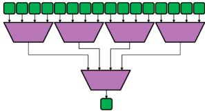
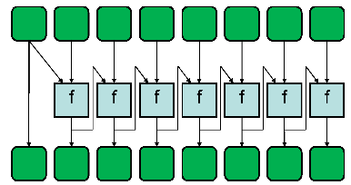

# Analýza a zpracování dat


<!-- ----------------------------------------------------------------------------------------------------------------- -->
## 1. Druhy dat, předzpracování dat, vlastnosti dat. Výběr atributů (zdůvodnění, princip, entriopie, Gini index, …)


<!-- ----------------------------------------------------------------------------------------------------------------- -->
## 2. Hledání častých vzorů v datech (základní principy, metody, varianty, implementace).


<!-- ----------------------------------------------------------------------------------------------------------------- -->
## 3. Shlukovací metody (shlukování pomocí reprezentantů, hierarchické shlukování).


<!-- ----------------------------------------------------------------------------------------------------------------- -->
## 4. Shlukování na základě hustoty, validace shluků), pokročilé metody shlukování (CLARANS, BIRCH, CURE).


<!-- ----------------------------------------------------------------------------------------------------------------- -->
## 5. Rozhodovací stromy (princip, algoritmus, metriky pro vhodnou volbu hodnot dělících atributů, prořezávání).


<!-- ----------------------------------------------------------------------------------------------------------------- -->
## 6. Pravděpodobnostní klasifikace (Bayesovský teorém, naivní Bayesovský teorém).


<!-- ----------------------------------------------------------------------------------------------------------------- -->
## 7. Support Vector Machines (princip, algoritmus, kernel trick).


<!-- ----------------------------------------------------------------------------------------------------------------- -->
## 8. Neuronové sítě (základní princip, metody učení, aktivační funkce).


<!-- ----------------------------------------------------------------------------------------------------------------- -->
## 9. Vyhodnocení klasifikačních algoritmů (chybovost, přesnost, pokrytí, f-metrika)


<!-- ----------------------------------------------------------------------------------------------------------------- -->
## 10. Regrese (lineární a nelineární regrese, regresní stromy, metody vyhodnocení kvality modelu)Typy sítí. Graf a matice sousednosti jako reprezentace sítě.


<!-- ----------------------------------------------------------------------------------------------------------------- -->
## 11. Datové struktury pro reprezentaci různých typů sítí, výhody a nevýhody (matice sousednosti, seznamy sousedů, stromy sousedů), složitost operací, hybridní reprezentace.


<!-- ----------------------------------------------------------------------------------------------------------------- -->
## 12. Topologické vlastnosti sítí, charakteristické hodnoty a jejich distribuce (stupeň, délka cesty, průměr, shlukovací koeficient), typy centralit.


<!-- ----------------------------------------------------------------------------------------------------------------- -->
## 13. Globální vlastnosti sítí (malý svět, bezškálovost, růst a preferenční připojování). Mocninný zákon a jeho interpretace v prostředí reálných sítí.


<!-- ----------------------------------------------------------------------------------------------------------------- -->
## 14. Modely sítí a jejich vlastnosti (Erdös–Rényi, Watts–Strogatz, Barabási–Albert).


<!-- ----------------------------------------------------------------------------------------------------------------- -->
## 15. Komunity. Globální a lokální přístupy. Modularita.


<!-- ----------------------------------------------------------------------------------------------------------------- -->
## 16. Jiné (pokročilé) modely sítí - multilayer sítě, modely orientované na komunitní strukturu, temporální sítě.


<!-- ----------------------------------------------------------------------------------------------------------------- -->
## 17. Odolnost sítí, šíření jevů v sítích.


<!-- ----------------------------------------------------------------------------------------------------------------- -->
## 18. Algoritmy pro pattern matching (Vyhledávání jednoho vzorku, více vzorků; Vyhledávání regulárních výrazů; Přibližné vyhledávání).


<!-- ----------------------------------------------------------------------------------------------------------------- -->
## 19. Dokumentografické informační systémy (DIS) (modely DIS - booleovský, vektorový, rozšířený booleovský; lexikální analýza, stemming a lematizace, stop slova, konstrukce indexů, vyhodnocení dotazu, relevance, přesnost, úplnost, F-míra).


<!-- ----------------------------------------------------------------------------------------------------------------- -->


<!-- ----------------------------------------------------------------------------------------------------------------- -->
## 20. Lineární algebra v DIS (metody redukce dimenze, rozklady matic, latentní sémantika, náhodná projekce).


<!-- ----------------------------------------------------------------------------------------------------------------- -->
## 21. Vyhledávání na webu (analýza hypertextových dokumentů, strukturální metody, PageRank a HITS, metavyhledávání a kooperativní vyhledávání).


<!-- ----------------------------------------------------------------------------------------------------------------- -->
## 22. Paralelní výpočty a platformy: Flynnova taxonomie, SIMD, MIMD, SPMD. Datový a task paralelismus. Procesy a vlákna.
- Multitasking v OS - Dovoluje vykonávání více než jednoho procesu (program + zdroje) najednou
  - Počet tasků může překročit požet fyzických jader / vláken na PC
- Paralelismus - souběh více jader/vláken najednou. (vlastnost systému)
- Concurrency - spolupráce dvou a více vláken, které mezi sebou komunikují. Nemusí běžět zároveň (např. multitasking)
- Proces - Běžící program spolu s hodnotami registru a proměnných v paměti
  - Programy jsou v procesním modelu organizovány do sekvenčních procesů
  - Procesy jsou nezávislé a izolovány pomocí OS
  - Procesy komunikují pomocí IPC *Inter-Process Communication*
  - Task-switching - když více procesů požaduje přístup ke skídeému zdroji, např. procesorový čas
  - Proces může být v několika stavech, viz Obrázek níže, vše řídí plánovač scheduler
- Datový paralelismus - SIMD, Jedna operace je prováděna na různých datech
- Task paralelismus - Mnoho operací je prováděno zároveň na (většinou) stejných datech.
  - Je využíváno několik jader nebo vláken procesoru.

{ width=60% }

- Vlákno - jednotka paralelního vykonávání v procesu
  - Mezivláknová komunikace je levnější jak IPC
  - Každé vlákno má svoje čítače, registry a stack
  - V rámci jednoho procesu vlákna sdílí paměťový a adresní prostor a zdroje (které jsou limitovány)

| Proces                                                    | Vlákno                                                            |
| :----------------                                         | :-----------------                                                |
| Náročné operace                                           | Nenáročná, jednodušší operace na řízení                           |
| Každý proces má svuj paměťový prostor                     | Vlákna sdílejí paměťový prostor procesu                           |
| IPC je pomalá, neboť procesy mají různé paměťové adresy   | Komunikace mezi vláky je rychlejší, neboť vlákna sdílejí paměť    |
| Přepínání mezi procesy je náročné                         | Přepínání mezi vlákny je jednodušší                               |
| Procesy nesdílejí paměť s jinými procesy                  | Vlákna sdílejí paměť s ostatními vlákny daného procesu            |

- IPC - komunikace mezi spolupracujicími procesy, která je pevně strukturována a nepoužívá přerušení
  - IPC musí řešit: předávání informací, závislosti a střety aktivit
    - dále synchronizaci, deadlock, zamykání
  - IPC je obvykle implementováno pomocí sdílené paměti a předávání zpráv
    - pipes, named pipes (stream zpráv), fronty zpráv, semafory, sdílená paměť a sockety

### Flynova taxonomie

{ width=60% }

- SISD - sériové, neparalelní počítač, Von-Neumannová architektura PC, deterministické vykonávání
  - Vylepšení pomocí:
    - zřetězení instukců v různých stavech vykonání instrukce (fetch, decode, execute, memory, write)
    - Vektorové operace nad vektorovými registry, instrukční sady SSE, SSE2, AVX, AVX-512
  - Superskalární architektura
  - *out-of-order* vykonávání - vykonávání více nezávislých instrukcí najednou
- MISD - každý výpočetní jednotka operuje nad stejnými daty ale s jinými instrukcemi
  - vzácná, né moc používaná architektura
  - jeden proud dat je posílán do více výpočetních jednotek
  - využití pro redundaci výsledků, bezpečnostní obvody (raketoplán), aplikace různých filtrů na data, brutefurce zlomení hesla
  - V součastnosti použití v systolickcýh polích - výpočetní sítě s distribuovanou pamětí a výpočetními jednotkami
    - FPGA, ASIC
- SIMD - Datový paralelismus, vektorové operace
  - všechny výpočetní jednotky vykonávají jednu instrukci, kterou mohou vykonávat na různých datech
  - dobré pro zpracování obrazu, maticové operace
  - je třeba synchronizačního kroku na konci
- MIMD - Moderní vícejádrové CPU, GPGPU (General Purpose Graphical Processing Unit), FP akcelerátory
- SPMD - Single Process Multiple Data
  - Několik samostatných výpočetních jednotek vykonává stejný program v různých bodech
  - Oproti SIMD nevyžaduje vektorové instrukce
  - Úkol je rozdělen a vykonáván ve více procesech najednou (stejné instrukce)
  - 


<!-- ----------------------------------------------------------------------------------------------------------------- -->
## 23. Systémy se sdílenou a distribuovanou pamětí: komunikace mezi procesy (souběh, uváznutí, vzájemné vyloučení). Komunikace pomocí zasílání zpráv. OpenMP, MPI.

### Systémy se sdílenou pamětí
- Výpočetní jednotky mají přístup k jedné globální paměti, kde jsou změny ihned viditelné
- CPU mohou operovat nezávislé ale nad sdílenou pamětí
- UMA systémy (Uniform Memory Access) - SMPs (Symmetric Multiprocessors)
  - Systémy s jedním typem procesoru, rovný přístup do paměti a stejné časy přístupu
  - Cache Coherent UMA (CC-UMA) - při změně v paměti jedním CPU, všechny ostatní CPU ví o této změně
    - Cache jsou aktualizovány konstantně
- NUMA (Non-uniform memory access) - CPU může přistupovat do paměti libovolného jiného CPU
  - časy přístupu se mohou lišit, a přístup do paměti jiného CPU je pomalejší
  - Znova existuje varianta Cache Coherent NUMA
- Výhody:
  - Jednodušší způsob programování - jednotný přístup do paměti
  - Sdílení dat mezi tásky je rychlé a uniformní, díky malé vzdálenosti procesorů
- Nevýhody:
  - Špatná škálovatelnost - více CPU znamená větší provoz mezi CPU a pamětí a větší nároky na Cache Coherent systém
  - Zodpovědnost programátora - programátor musí používat techniky synchronizace pro správnou práci s globální paměti

### Systémy s distribuovanou pamětí
- Používají komunikační síť pro meziprocesorový přístup k paměti
- Neexistuje globální paměťový prostor, CPU mají svoji vlastní lokální paměť a paměťový prostor není mapován na jiné CPU
- CPU pracují nezávisle a změny v paměti jednoho CPU nejsou inzerovány ostatním CPU
- IPC je explicitně řešeno programátorem, většinou pomocí zasílání zpráv
  - rychlost komunikace je nevýhodou
- Algoritmy na tyto systémy musí brát v potaz složitější komunikaci
- Výhody:
  - Lépe škálovatelné s více CPU
  - Rychlejší přístup CPU do lokální paměti (není overhead s cache coherence)
  - Levnější pořízení, možnost využít standardních CPU
- Nevýhody:
  - Programátor je zodpovědný za veškerou komunikaci
  - Složité mapování existujících datových struktur
  - Čas přístupu ke vzdálené paměti, neuniformní časy přístupu
- Hybridní systémy využívají jak sdílenou paměť mezi omezeným množstvím CPU a poté jsou propojeny distribuovanou pamětí s dalšími

### Problémy paralelních výpočtů
 - Deadlock (uváznutí) - procesy uváznou, jestliže všechny procesy čekají na určitou událost jiného čekajícího procesu
   - Process A čeká na exkluzivně držené prostředky procesem B, který zase čeká na prostředky procesu A
   - Situace kdy nastává deadlock: 
     - Vzájemné vyloučení
     - Držení prostředku a čekání na prostředky
     - Zacyklené čekání
   - Řešení uváznutí:
     - Ignorace problému
     - Detekce uváznutí a vyřešení
     - Opatrná alokace paměti
     - Prevence nějaké podmínky uváznutí
 - Souběh (Race condition) - chyba v systému nebo procesu, ve kterém jsou výsledky nepředvídatelné při nesprávném pořadí nebo načasování jeho jednotlivých operací
   - souběh je  způsoben chybným paralelním zpracováním sdílených dat
   - vzníká při neošetřeném přístupu více procesů/vláken ke sdílenému zdroji, paměti
 - Mutual Exclusion (MUTEX) - zámek, objekt, který zamězuje přístupu ke sdílenému zdroji více procesům najednou
   - Algoritmus používaný v programování jako synchronizační prostředek
   - Zabraňuje tomu, aby byly současně vykonávány dva (nebo více) kritické kódy nad stejným sdíleným prostředkem

### OpenMP
- soustava direktiv pro překladač programovacího jazyku, např. C++, která říká jak vykonat program paralelně.
- Standard pro systémy se sdílenou pamětí
- Hlavní vlákno (master) vytváří podle potřeby skupinu podvláken (slaves). 
  - Paralelizace programu se pak provádí postupně s ohledem na výkon aplikace, tj. sekvenční program je postupně (podle možností) paralelizován. 
- Možnost získat, zvolit počet CPU, nutno definovat privátní proměnné
- Příklady direktiv:
  - `#pragma omp parallel` - kód následujícího bloku je vykonáván ve více vláknech
  - `#pragma omp parallel for` - cykles je rozdělen mezi více vláken
  - `#pragma omp parallel for shared(sum, a) reduction(+: sum)` - paralelní redukce
  - `#pragma omp critical` - kritická sekce
  - 
- Výhody:
  - jednoduchý programovací model pomocí direktiv kompilátoru
  - jeden zdroj pro sériový i paralelní kód
  - portabilní a dobře podporovaný v rámci kompilátorů
- Nevýhody:
  - pouze v systémech se sdílenou pamětí
  - kompilátor musí podporovat OpenMP
  - vysoká pravděpodobnost závodění vláken

### MPI - Message Passing Interface
- Standard pro programování a návrh distribuovaných aplikací systému na systémech s distribuovanou pamětí pomocí zasílání zpráv
- rozhraní zprav je dáno, implementace závisí na distribuci
- MPI pracuje v komunikačním světě - kolekce procesů, které komunikují (koordinují) pomocí zpráv
  - komunikátor a skupiny určují hierarchii komunikujících procesů
  - *Rank* - Id procesu v rámci komunikátoru, určuje adresu při posílání, odesílání zpráv
  - *Size* - velikost komunikátoru, počet procesů v něm
  - Blokující operace - návrat až po po skončení, všechny zdroje opět k dispozici
  - Neblokující operace - možný návrat ještě před dokončením výpočtu
  - Synchronní komunikace - komunikace je ukončena až když příjemce dostane celou zprávu
  - Asynchronní komunikace - není synchronizována
- Příklady zpráv:
  - inicializace - `MPI_Init`, `MPI_Comm_rank`, `MPI_Comm_Size`
  - posílání zpráv - `MPI_Send`, `MPI_Receive`, `MPI_Sendrc` - blokující
- Zprávy jsou buď zasílány přímo na jediný Rank nebo pomocí broadcastu v rámci komunikátoru
- Datové struktury jsou posílány v datových typech podporovaných MPI, `MPI_INT`, `MPI_BYTE`
- Výhody:
  - MPI je podporováno na většine HPC systémů
  - využívá nativních HW optimalizací
  - obsahuje mnoho funkcí
- Nevýhody:
  - Deadlock
  - Nezaručené pořadí operací
  - Různé implementace ?

<!-- ----------------------------------------------------------------------------------------------------------------- -->
## 24. Paralelní redukce a paralelní scan: principy fungování ve vybrané technologii a příklady užití
### Redukce
- Jedna z nejvyužívanějších paralelních operací vůbec
- Redukce postupně kombinuje všechny elementy kolekce na jedno číslo. Kombinací často rozumíme součet.
- Postupně jsou vždy 2 elementy kolekce velikosti $n$ zkombinovány, toto se opakuje dokud nemáme jeden finální element
- Využívá se v mnoha algoritmech pro vypočítání chyby a vyhodnocení terminální podmínky v iteračních algoritmech
  - Genetické algoritmy, Buńkové algoritmy, Násobení matic, Zpracování obrazu

{ width=60% }

- V jednom paralelním kroku můžeme slučovat více než pouze 2 elementy, na obrázku to jsou v první úrovni 4
  - zaleží kolik chceme kroku (průchodů) redukce, zde to jsou 2
- Volba délky sériového bloku zavisí na vlastnostech výpočetní jednoty, registry, velikost cache
- Paralelni redukce je zabudována v OpenMP, MPI, a často se dělá v CUDE

<!-- https://en.wikipedia.org/wiki/Prefix_sum -->
### Scan
- taky nazývaný jako *Prefix-Sum*
- Inkluzivní scan bere v potaz aktuální vstupní hodnotu spolu s výsledkem předchozí iterace
- Exkluzivní scan nebere v potaz aktuální vstupní hodnotu

```cs
int foo(int, int) { ... }
...
int[] a = ...;
int[] b = ...;
a[0] = b[0];
for (int i = 1; i < n; i++) {
    a[i] = foo(a[i-1], b[i]);
}

```

{ width=60% }

- Každá iterace cyklu závisí na výsledku předchozí iterace
- SCAN algoritmus dostává na vstupu pole délky $n$ a výsledkem algoritmu je znovu pole délky $n$
  - každý prvek na indexu $i$ výsledného pole, je redukcí všech prvků vstupního pole do pozice $i$
  - redukce je specifikována kombnační funkcí, zde např. `foo`
- Jelikož je funkce `foo` asociativní (`foo(a, foo(b, c)) = foo(foo(a, b), c)`), může být tento algoritmus paralelizován
  - Paralelní scan počítá s tím, že tato funkce je asociativní, jinak by se nejednalo o paralelní scan a funkce by nešla paralelizovat
- Díky asociativitě této operace můžou být operace přeuspořádány podle 3 různých přístupů (1. je seriový)
- Sérivoý přístup provede kombinaci jen $O(n)$ krát, tedy méně krát, ale naivní paralelní přístup bude rychlejší
- Paralelní scan neškáluje lineárně s počtem jader
- Implementován v OpenMP, MPI, C++, Rust
- První přístup vidíme na obrázku níže. Pro každý výsledný element je vytvořen redukční strom a duplicitní redukce jsou sloučeny.
  - Kombinující funkce je provedena $O(n\log n)$ krát (work complexity, počet provedených operací)
  - Nejdelší cesta přes graf je *step complexity* zde je $O(\log n)$
  - Tento přístup má kratší nejdejší cestu grafem, dovoluje více paralelismu ale není efektivní v rámci provedené práce
- Druhý přístup na posledním obrázku
  - delší nejdelší cesta ale je více efektivní v rámci provedené práce
  1. Vypočti součet po sobě jdoucích párů, tak, že první element páru ma sudý index. $z_0 = x_0 + x_1, z_1 = x_2 + x_3, \ldots$
  2. Rekurzivně vypočti prefixovou sumu $w_0, w_1, \ldots$ sekvence $z_0, z_1, \ldots$
  3. Každý element výsledné sekvence je součet až dvou prvků sekvencí $x,z,w$, $y_0=x_0, y_1 = z_0, y_2 = z_0 = x_2, y_3 = w_0$

TODO !!!

"){ width=60% }

"){ width=60% }