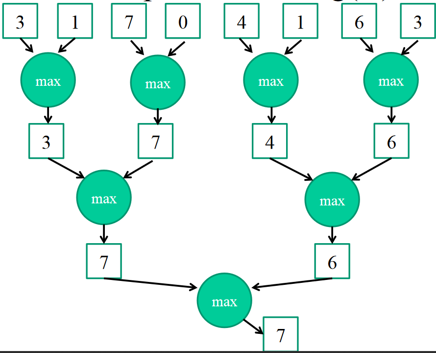

# Analýza a zpracování dat

<!-- ----------------------------------------------------------------------------------------------------------------- -->
## 1. Druhy dat, předzpracování dat, vlastnosti dat. Výběr atributů (zdůvodnění, princip, entriopie, Gini index, ...)
- Data s labely - Máme k dipozici trénovací data, ke kterým známe GT (Ground Truth), hodnotu atributu, který chceme predikovat - Supervised learning
  - Klasifikace, Regrese
- Data bez labelů - Data nemají žádný předem známy atribut - Unsupervised learning
  - Asociační pravidla, Shlukování
- Personální informace - data o lidech, je třeba anonymizovat a pracovat s nima bezpečně
- Koncept - věc kterou se cheme naučit, jednou z metod - klasifikace, regrese, shlukování nebo asociativní pravidla
- Vzhledem k typu proměnné se atributy dělí na 3 základní typy:
  - Kategoriální, Diskrétní - nominální, binární a ordinální proměnné
    - Kategoriální - Hodnoty atributu jsou omezeny množinou možných hodnot
    - Nominální - Hodnoty se nedají seřadit, lze určit pouze rovnost. Speciálním typem je binární proměnná (0 nebo 1)
    - Ordinální - Hodnoty se dají seřadit ve smysluplném pořadí
  - Numerické, Spojité - celočíselné, intervalové nebo škálované hodnoty
    - Numerický - celé nebo realné číslo
    - Intervalový - Známe pořadí hodnot i přesné rozdíly mezi dvěmi hodnotami. Nemají pravou nulovou hodnotu. Teplota °C
    - Škálový - Známe pořadí hodnot i přesné rozdíly mezi dvěmi hodnotami. Mají pravou nulovou hodnotu. Nulová hodnota značí absenci měření. Teplota K
  - Ignorované - atribut je k ničemu
- Předzpracování, čištění dat
  - Převod dat do formy, která může být analyzována, často náročnější než samotná analýza
  - Odstranění šumu, uprava hodnot atributů, normalizace hodnot
  - Normalizace do intervalu nebo standardní normalizace na $z$-skóre
    - $x_i' = \frac{x_i - \min_i\{x_i\}}{\max_i\{x_i\}-\min_i\{x_i\}}$
    - $x_i' = \frac{x_i - \mu}{\sigma}$
  - Šum jsou instance v datech, které jsou špatně změřeny
  - Chybějící data - pro určité instance chyby hodnoty některých atributů, řešení:
    - Odstranění těchto instancí
    - Nahrazení chybějící hodnoty nejčetnější nebo průměrnou hodnotou
  - Redukce počtu atributů - né všechny atributy přispívají stejnou mírou k analýze, delší analýza
    - Redukce dimenze, Feature reduction
- Redukce dimenze - forma předzpracování dat
  - Mnohodimenzionální data jsou problémová - mnoho atributů je zašuměných, některé atributy spolu velmi korelují (jsou tedy skoro duplicitní)
  - Redukce dimenze je optimální mapování do nižší dimenze
  - Každá nová dimenze je lineární/nelineární kombinací originálních atributů
  - PCA (*Principal Component Analysis*) - cílem je zrotovat data tak, aby jsme zachovali co nejvíc odchylky dat v malém množství dimenzí
  - SVD je zobecněním PCA, redukce na vybraný počet dimenzí, viz MATD
-

### Výběr atributů
- Filter modely - přesné matematické kritéria pro ohodnocení podmnožin atributů
  - $V_i$ jsou hodnoty daného atributu
  - $p_j$ je část bodů (relativní četnost) obsahující hodnotu atributu $V_i$, patřící do třídy $j$ ze všech $k$ možných tříd
  - $n$ počet objektů, $n_i$ počet objektů s hodnotou atributu $V_i$
  - Gini Index - míra pravděpodobnosti, že náhodně zvolený objekt z trénovací množiny, bude zařazen do špatné třídy, pokud bude zařazen podle hodnot zvolených atributů (podmnožina atributů)
    - 0 když budou všechny objekty správně zařazeny, 1 pro náhodnou klasifikaci
    - Hodnota pro hodnotu atributu - $G(V_i) = 1 - \sum\limits_{j=1}^k p_j^2$, 
    - Hodnota pro atribut - $G = \frac{1}{n} \sum\limits_{i=1}^r n_i G(V_i)$
  - Entropie - míra nejistoty v trénovací sadě, způsobena výskytem více možných klasifikací
    - Entropie měří míru získané informace při zafixování hodnoty atributu
    - Při dělení rozhodovacích stromu se často volí atribut, který minimalizuje hodnotu entropie
    - $E(V_i) = -\sum\limits_{j=1}^k p_j \log_2 p_j$
    - $E = \frac{1}{n} \sum\limits_{i=1}^r n_i E(V_i)$
  - Fisher score - pro numerické atributy
- Wrapper modely - model je vyhodnocen na každé podmnožině atributů
  - Různé modely klasifikátorů jsou přesnější s jinými množinami atributů
  - Wrapper modely dostanou na vstupu specifický model a pro něj optimalizují výběr atributů
  - Iterativně vylepšíju množinu atributů přidáváním dalších atributů
    - Začínají s prázdnou množinou $F = \emptyset$
    - Přidají 1 nebo 2 atributy do $F$, vyhodnotí model a rozhodnou se jestli tyto atributy nechat v $F$
- Embedded modely - informace získána v modelu je využita k eliminaci irelevantních atributů

<!-- ----------------------------------------------------------------------------------------------------------------- -->
## 2. Hledání častých vzorů v datech (základní principy, metody, varianty, implementace).

### Dolování častých vzorů
- Cílem je nalézt asociace mezi skupinami položek
- Nalezené množiny položek se označují jako FIS (*Frequent ItemSets* viz MPZZ)

- Snaha nalézt jen důlěžité vzory, vzor je důležitý pokud je častý, platí aspoň pro 20% řádků, transakcí
- Transakce $T = \{T_1, T_2,\ldots,T_n\}$, transakce $T_i = \{u_{i1},u_{i,},\ldots,u_{in} \}$, položek $U = \{u_1,u_2,\ldots,u_n\}$
  - Množina položek, itemset - podmnožina $U$
  - $k$-množina položek, $k$-itemset - množina přesně $k$ položek z $U$
- Podpora mnižiny položek $supp(I)$ je definována jako relativní četnost transakcí, které obsahují $I$ jako podmnožinu
- Dolování FIS - Nalezení všech množin položek, které se vyskytují v množině transakcí, s hodnotou `support` větší nebo rovno `minsup`
- Podpora podmnožiny položek $J$ množiny položek $I$ je alespoň tak velká jako podpora $I$ $sup(J) \geq sup(I) : \forall J \subseteq I$
  - Každá podmnožina časté množiny položek je taky častá
  - Maximální FIS - FIS který nemá žádný superset jako FIS, největší možný FIS
- Brute Force vyhledávání FIS
  - přístup je velmi výpočetně náročný, extrémní množství kombinací, $2^n$ pro $n$ binárních atributů
  - Nutnost u všech kontrolovat `support`
- Vylepšená varianta Brute Force
  1. Vygeneruj postupně kombinace položek s rostoucí délkou, začíná na délce 1
     - Generování nesmí vytvářet duplicity a nejlépe generovat v lexikografickém pořadí
  2. Využij pravidla, že "Každá podmnožina časté množiny položek je taky častá"
  3. Dále ignoruj ty množiny, které nedosahují `minsup`
  4. Pokračuj generováním delších množin
- Algoritmus Apriori viz MPZZ
- Efektivní počítání supportu, využívá se HashTree pro detekci množiny položek v transakci
  - Všechny metdy využívají lexikografického uspořádání
  - Všichni kandidáti (množiny položek) jsou v listech
  - Vnitřní uzly jsou Hashovací tabulky, definují cestu z kořene do listu
  - Jedna úroveň stromu odpovídá jedné položce kandidáta
- Enumeration Tree definován na množině FIS
  - Každý uzel ve stromu reprezentuje jeden FIS, Kořen je prázdná množina
  - Jedna se o strukturu Trie, Prefixový strom, potomci uzly jsou řazeny lexikograficky
  - Potomek je lexikograficky až za předkem
- Tree Projection - obecný framework pro databázovou projekci na množiny položek
  - Založeno zase na principu: Pokud transakce neobsahuje množinu položek, která koresponduje na FIS v Enumeration Tree, tak transakce je nerelevantní a její potomci jsou taky nerelevantní
- Vertical Counting Methods - transponované transakční databáze
  - Větší paměťové nároky, rychlejší díky implicitnímu seznamu transakcí
  - Výpočet support se odkazuje na délku transakčího seznamu
  - Slučování je operace vkládání seznamu s lineární složitostí
  - Algoritmy: Partition, Monet, Eclat, VIPER
- Pearsnův koeficient korelace dvou položek $i$ a $j$
  - Výsledek 1 značí maximální korelaci a -1 maximální negativní korelaci
- Jak zpracovat jiné typy atributů (nutné znát doménu problému):
  - Numerické - rozdělit do podintervalů (uniformní nebo podle pravděpodobnosti výskytu)
  - Kategoriální - Binarizace do více sloupců, Sloučneí podobných kategorií
- Aplikace dolování vzorů:
  - Klasifikace - nalezení asociačních pravidel
  - Detekce outlierů (odlehlých pozorování) - nalezení transakcí, které nejsou pokryty žádným vzorem
  - Analýza webových logů
  - Bioinformatika - gene-expression data
  - Kolaborativní filtrování a doporučování - shlukování uživatelů podle jejich chování

### Asociační pravidla
- Pravidla v datech, jestliže je slunečno tak se hraje (`if outlook = sunny then play = yes`)
  - $X \rightarrow Y$
- Mnoho pravidel, nutná redukce pomocí metrik podpory a důvěry.
- $supp = \frac{r}{N}$
- $conf(X \rightarrow Y) = \frac{sup(X \cup Y)}{sup(X)}$
- Pravidlo je asociační jestliže:
  - Podpora $X \cup Y$ je alespoň `minsup`
  - Důvěrihodnost (conf) pravidla $X \rightarrow Y$ je alespoň `minconf`
- Generování pravidel:
  1. Fáze - vygenerování všech FIS s `minsup`
  2. Fáze - vygenerování všech asociačních pravidel s alespoň `minconf`
     - pro každý FIS vygeneruj všechny možné kombinace $X$ a $Y$ a vypočti důvěrihodnost


<!-- ----------------------------------------------------------------------------------------------------------------- -->

## 3. Shlukovací metody (shlukování pomocí reprezentantů, hierarchické shlukování).
- Shlukování - Seskupování objektů, které jsou si podobné a jsou nepodobné objektům v jiných shlucích
- Podobnost se často měrí pomocí vzdálenosti mezi objekty
- Aplikace shlukování - shlukování zákazníků, shlukování zemí, shlukování chyb
  - Sumarizace dat, segmentace zákazníků, analýza sociálních sítí
- Geomterický střed (Centroid) - průměrná hodnota všechh objektů ve shluku, průměr hodnot ve všech dimenzích
- Cílem je minimalizovat vzdálenost objektů od středu shluku, do kteréhé patří
  - $SSE(\mathcal{C}) = \sum\limits_{i=1}^k\sum\limits_{x_j\in C_i} || x_j - \mu_i ||^2$ pro $k$ shluků
- Vzdálenost mezi objekty je většinou Euklidovská vzdálenost, obecně viz MPZZ (*Minkovského metrika*)
- Místo vzdálenosti se taky dá počítat podobnost, např. kosinova podobnost $\cos(X,Y) = \frac{X \cdot Y}{||X||\cdot||Y||}$
- $k$-Means
  - Každý objekt náleží právě do jednoho shluku
  - Vstupem je počet shluků $k$
  - Algoritmus:
    1. Nastav $k$
    2. Vyber $k$ náhodných objektů jako centra shluku
    3. Přiřaď každý objekt do shluku, ke kterému je nejblíž (nejblíže k centroidu)
    4. Přepočti centroidy shluků
    5. Opakuj kroky 3. a 4. dokud se mění shluky
 - Kvůli náhodnému výběru se $k$-Means spouští několikrát a vybírá se nejlepší výsledek
 - Může konvergovat k lokálnímu minimu
 - Vhodné pro kulové shluky
- $k$-Medians
  - Používá Manhattenovskou vzdánelost
  - Centroidem v každém shluku je median v každé dimenzi
- $k$-Medoids
  - Centroidy jsou nejstřednější body ve shluky, nejedná se tedy o "umělý" bod
  - Začátek jako $k$-Means/Median, přepočítávání podle:
    - Pro každý pár - (medoid, objekt) - vypočti cenu záměny těchto dvou bodů, pokud je to nejmenší cena tak si ji zapamatuj
    - Pokud změna zlepší kvalitu shlukování tak ji proveď jinak ukonči algoritmus
- Hierarchické shlukování
  - Aglomerativní - Každý objekt je vlastním shlukem, postupně jsou shluky spojovány
    1. Přiřaď každý objekt svému shluku a vypočti vzdálenosti mezi shluky
    2. Spoj dva nejbližší shluky v jeden
    3. Přepočti vzdálenost nového shluku od ostatních
    4. Opakuj kroky 2. a 3, dokud nedostaneme jeden shluk
  - Divizivní - Začínáme jedním velkým shlukem, který je postupně rozdělován
  - Shlukování můžeme zastavit když už neplatí nějaká podmínka pro shluky
  - Vzdálenost se často řeší matici vzdáleností
  - Dendogram je graf znozorňující postupné spojování shluků, můžeme se v něm rozhodnout kde shlukování zastavíme
- Vzdálenosti mezi shluky
  - Single-Linkage - Nejkratší vzdálenost mezi dvěma shluky (objekty ve shlucích)
  - Complete-Linkage - Nejdelší vzdálenost mezi dvěma shluky (objekty ve shlucích)
  - Average-Linkage - Průměrná vzdálenost mezi dvěma shluky (objekty ve shlucích)
  - Closest centroid - nejbližší centroidy. Používá se v Aglomerativním shlukování, shluky s nejbližšími centroidy jsou sloučeny.


<!-- ----------------------------------------------------------------------------------------------------------------- -->
## 4. Shlukování na základě hustoty, validace shluků), pokročilé metody shlukování (CLARANS, BIRCH, CURE).

### Shlukování na základě hustoty - parametry $p$ a $\tau$
- Cílem je identifikovat husté (*jemno-zrné*) oblasti v datech, reprezentující shluky
  - tvar a počet shluků nejsou předem definovány
  - dá se uvažovat za dvojúrovňové hierarchické shlukování
- Algoritmy založené na mřížce
  - data jsou rozdělena do $p$ intervalů (obvykle stejné velikosti), pro $d$ dimenzí uvažujeme $p^d$ hyperkrychli
  - Práhová hodnota hustoty $\tau$ - minimální počet bodů v hyperkrychli, určuje počet hustých hyperkrychlí
  - Shluky jsou vytvořeny z propojených oblastí
    - Oblasti v mřížce jsou spojeny pokud sdílí stranu nebo roh
  - Cílem je nalézt oblasti spojené hustými podoblastmi (hyperkrychle)
    - Spojení se dá nalézt pomocí BFS nebo DFS
  - Malé $p$ - smíchání bodů z více shluků, Velké $p$ hodně prázdných, nehustých oblastí
  - Malé $\tau$ - Mnoho hustých oblastí, Velké $\tau$ - málo shluků
  - Vhodné pro shluky s konzistentní hustotou
- DBSCAN
  - Oblast je sférická s poloměrem $\epsilon$
  - Body jsou rozděleny do 3 kategorií:
    - Jádrový Core bod - bod s alespoň $\tau$ body ve sféře o poloměru $\epsilon$
    - Hraniční bod - bod s méně než $\tau$ body ve sféře o poloměru $\epsilon$, v této sféře má ale jádrový bod
    - Šumový bod - bod, který není jádrový ani hraniční
  - Algoritmus:
    1. Nalezni jádrové, hraniční a šumové body
    2. Vytvoř souvislý graf z jádrových bodů
       1. Každý uzel odpovídá jádrovému bodu
       2. Jestliže je vzdálenost mezi jádrovými body menší jak $\epsilon$ vytoř mezi nimi hranu
    3. Identifikuj spojené komponenty grafu
    4. Okrajové body jsou připojeny k nejbližšímu shluku
    5. Propojené komponenty jsou shluky, šumové body jsou outlieři
 - Lepší shlukování při výskytu šumu
 - Hladší obrys shluku
- DENCLUE
  - Využítí kernelové, jádrové funkce
  - Kernelový odhad se využívá k vytváření hladkého profilu distribuce hustoty
  - Každé lokální maximum hustoty se chová jako attractor
  - Všechny ostatní body jsou přiřazeny k aktraktovům pomocí Hill Climbing algoritmu, vytvoření shluků
  - Attractors s hustotou méně než $\tau$ jsou zahozeny, ostatní jsou shluky
  - Spoj shluky, spojené cestou s hustotou alespoň $\tau$

### Validace shluků
- Vnitřní validace - vhodná když neznáme externí kritéria shluků
  - většina kritérií jsou zaujaty k nějakému algoritmu
  - používají se většinou k ohodnocení více běhu stejného algoritmu
  - Suma kvadratické vzdálenosti bodů od centroidu pro všechny shluky
  - Poměr vzdálenosti ve shluku ku vzdálenostem mimo shluk - menší poměr $\frac{\textit{Intra}}{\textit{Inter}}$ je lepší
    - $P$ páry bodů stejného shluku
    - $Q$ páry bodů, nepatřící do stejného shluku
    - $\textit{Intra} = \frac{1}{|P|} \sum\limits_{(X_i,X_j) \in P} dist(X_i,X_j)$
    - $\textit{Inter} = \frac{1}{|Q|} \sum\limits_{(X_i,X_j) \in Q} dist(X_i,X_j)$
  - koeficient Siluety - porovnáná podobné vzdálenosti
    - Hodnoty od -1 do 1. Hodnoty blízko 1 znamenají doře rozdělené shluky, Negativní hodnoty znamenají promíchané shluky
    - $\textit{Dmin}_i^{out}$ - minimální průměrná vzdálenost bodu $X_i$ ke všem ostatním shlukům
    - $\textit{Davg}_i^{in}$ - Průměrná vzdálenost bodu ke všem ostatním bodům v rámci shluku $X_i$
    - $S_I = \frac{\textit{Dmin}_i^{out} - \textit{Davg}_i^{in}}{\max\{ \textit{Dmin}_i^{out}, \textit{Davg}_i^{in} \}}$
    - Celkový koeficient je průměrem koeficientů všech bodů
- Vnější validace - dá se použít když známe Ground Truth
  - Známe správné rozdělení shluků, tedy třídy jednotlivých objektů
  - Jestliže je počet tříd a shluků stejný, můžeme použít Matici záměn
  - Čistota shluků - shluky by měli obsahovat objekty pouze jedné třídy
  - Gini index
  - Entropie

### Pokročilé modely shlukování
- CLARA
  - Škálovatelná implementace $k$-medoidů
  - Založeno na PAM (*Partitioning Around Medoids*) - rozdělení okolí medoidů
    - Všechny kombinace dvojic jsou vyzkoušeny pro záměnu jak bylo popsáno výše
    - Složitost $O(k(n-k))$, $O(kn^2d)$ pro $d$ dimenzí
  - CLARA vyzkouší jen několik dvojic, aby omezila velkou výpočetní náročnost
  - Je zvolen vzorkovací koeficient $f \ll 1$
  - Body, které nejsou součástí náhodného vzorku, jsou přiřazeny nejbližšímu medoidu
  - Vzorkování probíhá opakovaně vzorkami stejné velikosti $f \cdot n$
  - Ze všech shlukování je vybráno to nejlepší
  - Složitost jedné iterace: $O(k \cdot f^2 \cdot n^2 \cdot d + k \cdot (n-k))$
- CLARANS - *Clustering Large Applications based on Randomized Search*
  - Řeší problém CLARA, když v žádném vzorku není dobrý výběr medoidů
  - Algoritmus pracuje s celým datasetem
  - Algoritmus iterativně zkouší vyměňovat medoidy s nemedoidy
    - Kvalita výměna je vyhodnocena ihned
    - Při zlepšení je výměna provedena, jinak je inkrementován čítač neúspěšných výměn
  - Lokálně optimální řešení je nalezeno, když je dosaženo určitého počtu neúspěchů
  - Toto hledání lokálního optima je opakovano *MaxLocal* krát
    - V každé iterace je vyhodnocena kvalita shlukování
  - Oproti CLARA prohledá větší prostor
- BIRCH - *The Balanced Iterative Reducing and Clustering using Hierarchies*
  - Kombinace divizivního přístupu a $k$-means
  - Používá se CF-Tree
    - Výškově balancovaná datova struktura pro organizace shluků
    - Každý uzel ma faktor rozdělení nejvíce $B$
  - Každý uzel obsahuje souhrn nejvíce $B$ podshluků
  - Informace o shluku je uložena v CF vektoru (*Cluster Feature Vector*)
    - SS - vektor kvadratických součtů bodů ve shluku
    - LS - vektor lineárních součtů bodů ve shluku
    - $m$ - počet bodů ve shluku
    - Každý CF může být reprezentován lineárním součtem CF jednotlivých bodů
    - CF předka je součet CF jeho potomků
    - CF sloučeného shluku může být vypočteno součtem CF
    - Z CF se dají vypočítat důležité vlastnosti shluku (poloměr, centroid)
    - Každý list má práhovou hodnotu průměru $T$, která reguluje granularitu shlukování, výšku stromu a agregovaný počet shluků v listech
    - Hodnota $T$ je závislá na velikosti datasetu
    - Menší $T$ - větší počet jemnězrných shluků
    - Přidání do stromu je shora dolů, Nejbližší centroid je použit v každé úrovni stromu, CF jsou postupně aktualizovány
    - Bod je přidán do shluku v listu, pokud neporušuje podmínku průměru $T$, jinak je vytvořen nový shluk s tímto jedním bodem


{ width=60% }


- CURE - *Clustering Using REpresentatives*
  - Algoritmus:
    1. Vytvoř náhodný vzorek $s$ datasetu $D$ o velikosti $n$
    2. Rozděl vzorek $s$ na $p$ částí velikosti $\frac{n}{p}$
    3. Každou část seshlukuj zvlášt na $k$ shluků pomocí aglomerativního shlukování. Výsledkem je $k\cdot p$ shluků ve všech částech.
    4. Proveď aglomerativní shlukování na $k\cdot p$ shlucích za výsledku $k$ shluků
    5. Přiřaď všechny body, které nebyly vybrány v rámci vzorku, ke shluku s nejbližším reprezentantem (centroid)
 - Příliš alé shluky jsou eliminovány jako outlieři
 - Vzdálenosti mezi shluky se měří pomocí vzdálenosti mezi reprezentanty (centroid)

<!-- ----------------------------------------------------------------------------------------------------------------- -->
## 5. Rozhodovací stromy (princip, algoritmus, metriky pro vhodnou volbu hodnot dělících atributů, prořezávání).
- Rozhodovací strom je vytvořen pomocí dělení se na hodnotě atributu - hierarchické rozhodování
- Uzel reprezentuje rozdělení datasetu (split criterion), které je založeno na hodnotě jednoho nebo více atributů
- Cílem je vybrat takové rozdělení, které minimalizuje promíchání tříd v každé větvi stromu, tedy maximalizuje separaci různých tříd potomků
  - Binární atribut - 2 větve
  - Kategoriální atribut s $r$ hodnotami - $r$ větví
  - Numerický atribut - Rozdělení do podintervalů, nebo zvolení jedné hodnoty (náhodné nebo testování všech) a použití $< \vee \leq$ relace
  - Využívá se Gini indexu, Entropie nebo Error Rate
- Error Rate - $Err(S) = 1 - p$, kde $p$ je relativní četnost bodů, patřících do dominantní třídy množiny $S$
  - pro $r$ větví - $Err(S \rightarrow S_1,S_2,\ldots,S_r) \sum\limits_{i=1}^r \frac{|S_i|}{|S|}(1 - p)$
- Uzly jsou rekurzivně děleny, až do terminující podmínky
  - Čistý uzel - pouze jedna třída v uzlu - overfitting
  - Minimální počet objektů v uzlu
- Prořezávání stromu
  - Část trénovacího datasetu se oddělí pro prořezávání
  - Uzel je odstraněn, jestliže jeho odstranění zvýší přesnost klasifikace
  - Iterativní odstraňování listů
- Algoritmus TDIDT (Top-Down Inductuion of Decision Trees)
  - Jestliže všechny instance trénovací sady patří do jedné kategorie tak ji vrať tuto kategorii, jinak
  - Vyber atribut $A$, na kterém bude provedeno dělení (ve stejné větvi není nikdy vybrán stejný atribut)
  - Rozděl všechny instance trénovací sady podle hodnoty daného atributu $A$
  - Vrať strom, kde každá unikátní hodnota atributu $A$ je reprezentována svou větví
  - Strom je dále rekurzivně budován
  - Nevýhody algoritmu:
    - Dvě instance stejných hodnot nemohou být v různých kategoriích
    - Nijak nespecifikuej výběr atributu $A$
- Klasifikační nebo regresní lesy
  - Využití více různých stromů, kde výsledky jsou kombinovány nebo zvolen ten nejlepší


<!-- ----------------------------------------------------------------------------------------------------------------- -->
## 6. Pravděpodobnostní klasifikace (Bayesovský teorém, naivní Bayesovský teorém).
- Klasifikace - rozdělení objektů do exkluzivních kategorií, kterým se říká třídy. Každý objekt musí patřít do právě jedné třídy.
  - Výstupem klasifikace je buď přímo daný label pro objekt nebo pravděpodobnosti zařazení do různých tříd
- Využívá se trénovací a testovací dataset
- Bayesův teorém pro výpočet podmíněné pravděpodobnosti že platí hypotéza H, pokud pozorujeme evidenci E má podobu: 
  - $P(H|E) = \frac{P(E|H)P(H)}{P(E)}$
  - Využití, když je těžké získat pravděpodobnost $P(D|E)$ ale ostantí pravděpodobnosti jsou jednoduché
- Naivní bayesovský klasifikátor vychází z předpokladu, že jednotlivé atributy jsou nezávislé při určování třídy
  - $c$ je určitá třída, jejiž pravděpodobnost chceme znát
  - $\vec{A}$ je $d$-dimenzionální instance objektu $\vec{A} = (a_1,\ldots,a_d)$, realný objekt datasetu
  - $\vec{X}$ je $d$-dimenzionální náhodná proměná objektu $\vec{X} = (X_1,\ldots,X_d)$, náhodný vektor
  - Cílem je odhadnout pravděpodobnost $P(C = c | X_1 = a_1,\ldots,X_d = a_d) = \frac{P(X_1 = a_1,\ldots,X_d = a_d | C = c)P(C = c)}{P(X_1 = a_1,\ldots,X_d = a_d)}$
  - Čitatel je nezávislý na třídě a může být vynechán, jelikož předpokládáme nezávilost mužeme řict, že:
  - $P(X_1 = a_1,\ldots,X_d = a_d | C = c) = \prod_{j=1}^d P(X_j=a_j | C = c)$
  - a tedy:
  - $P(C = c | X_1 = a_1,\ldots,X_d = a_d) = P(C = c)\prod_{j=1}^d P(X_j=a_j | C = c)$
- Nevýhodou je, že umí pracovat pouze s Kategoriálními atributy a pravděpodobnost je dána relativní četností
  - Diskretizace nebo binarizace numerických hodnot
- Naivní předpoklad je většinou nepravdivý v datech realného světa
  - komplexnější odhady jsou méně přesné ve vyšších dimenzích


<!-- ----------------------------------------------------------------------------------------------------------------- -->
## 7. Support Vector Machines (princip, algoritmus, kernel trick).
- Binární klasifikace numerických dat
  - kategoriální data mohou být použita po binarizaci
  - Výsledkem je jeden z labelů -1 nebo 1
  - 2 kategorie jsou rozděleny nadrovinou (hyperplane)
    - Nadrovinou se v geometrii rozumí pro daný prostor dimenze $n$ jakýkoliv jeho podprostor dimenze $n-1$.
- Klasifikace více tříd:
  - Metoda jeden proti všem - jedna třída je odlišována od všech ostatních tříd, je potřeba SVM klasifikátor pro každou třídu
  - Metoda jeden proti jednomu - Jedno SVM pro každý pár tříd, výsledná třída je ta, která byla nejvíce klasifikovaná ve všech SVM
- Existuje nekonečně mnoho způsobů jak rozdělit body podle nadroviny
  - Cílem je maximalizovat minimální vzdálenost mezi body dvou tříd, 

{ width=60% }

- K rozdělující nadrovině se vytvoří dvě rovnoběžné hraniční nadroviny, tak, že se dotýkají bodů z obou kategorií
  - Cílem je maximalizovat délku kolmice mezi těmito nadrovinami
  - Bodům na těchto rovinách se říká *Support Vectors*
    - Objekty, které se nejhůře klasifikují
    - Přímo ovlivňují volbu hraničních nadrovin
  - Vzdálenost mezi těmito dvěma nadrovinami je *margin*
  - Rozdělovací nadrovina je přesně mezi těmito dvěmi rovinami
- Algoritmus:
  - $n$ je počet bodů v trénovací sadě $D$
  - $i$-tý bod $(X_i, y_i)$, kde $X_i$ je $d$-dimenzionální vektor a $y_i$ je třída -1 nebo 1
    - $\vec{W}\cdot\vec{X} + b = 0$
  - $\vec{W}=(w_1,\ldots,w_d)$ je $d$-dimenzionální vektor obsahující směr normál (přímka kolmá na daný podprostor) nadroviny
  - $b$ je skalár *bias*
  - 
  - Body obou tříd musí ležet na opačných stranách nadroviny
    - $\vec{W}\cdot\vec{X_i} + b \geq 0 \quad \forall i : Y_i = +1$
    - $\vec{W}\cdot\vec{X_i} + b \leq 0 \quad \forall i : Y_i = -1$
    - $y_i(\vec{W}\cdot\vec{X_i}+b)\geq +1$
    - $y_i(\vec{W}\cdot\vec{X_i}+b) - 1\geq 0$
  - Cílem je maximalizovat vzdálenost mezi dvěma rovnoběžnými nadrovinami
    - $\frac{2}{||\vec{W}||} = \frac{2}{\sqrt{\sum_{i=1}^d W_i^2}}$
  - Nebo minimalizovat:
    - $\frac{||\vec{W}||^2}{2}$
  - Maximalizace prostoru mezi okrajovými nadprostory je řešena přes Lagrangeovy multiplikátory a po úpravách závisí pouze na skalárním součinu podpůrných vektorů obou tříd
- Pro neseparabilní data existuje *soft margin*
  - Představena panalizace pro body porušující *margin*
  - $\vec{W}\cdot\vec{X_i} + b \geq 0  - \xi_i \quad \forall i : Y_i = +1$
  - $\vec{W}\cdot\vec{X_i} + b \leq 0  + \xi_i \quad \forall i : Y_i = -1$
  - $\forall i : \xi \geq 0$
  - $\frac{||\vec{W}||^2}{2} + C\sum_{i=0}^n\xi_i$
  - Parametr $C$ kontroluje dovolenou chybu během trénovaní, větší $C$ je větší trest, takže menší chyba

### Kernelový trik
- Nelineární rozdělení - v realných případech se nedají data rozdělit pomocí přímky
- Využití Coverova teorému, který říká, že data, těžko rozdělitelná ve své dimenzi bude možna lehčí rozdělit v dimezi vyšší
- Řešením ve vyšším prostoru se mění skalární součin, kde je na elemenety součinu nejdříve aplikovaná mapovací funkce $\phi$
- Trik je v tom, že aby jsme nalezli nadrovinu, nejlépe rozdělující body, ve vyšším prostoru, nemusíme vypočítat transformavané vektory, jelikož se vyskytují pouze ve skalárním součinu
- Místo toho se může použít *Kernelová* funkce, která je definovaná jako skalární součin dvou transformovaných vektorů
- Mapování: $\phi : \mathcal{R}^n \rightarrow \mathcal{R}^m, m \geq n$
- $K(x,z) = \phi(x) \cdot \phi(z)$, kde $x$ a $z$ jsou Kernelové funkce, kernely
- Proces mapování do vyšší dimenze se nazývá Kernel trik
- Typy kernelů:
  - Lineární
  - Polynomiální
  - Gaussian
  - RBF kernel

<!-- ----------------------------------------------------------------------------------------------------------------- -->
## 8. Neuronové sítě (základní princip, metody učení, aktivační funkce).
- Model algoritmus navržený podle nervového systému člověka
- Systém se skládá z neuronů
  - Tyto neurony dostavají vstupní signál, které vnitří operací převádějí na výstupní signál
- Celkový výpočet je ovlivňován váhou neuronu a aktivačními funkcemi
- Proces učení postupně upravuje tyto váhy. Váha neuronu je analogická síle synapse.
- Architektury NN:
  - Jednovrstvé - Perceptron
    - Vstupní vrstva ma neuron pro každý vstupní atribut a pouze posílá hodnoty výstupnímu neurono
    - Spojení mezi vstupními neurony a výstupním neuronem je vážené
    - Výstupní neuron vypočítá výslednou hodnotu
  - Vícevrstvé (Hluboké NN)
    - Přidávají vnitřní skryté vrstvy
    - Vnitřní vrstvy se mohou skládat z různých typů vrstev
    - Výstupy jedné vrstvy jsou posílány do následující vrstvy, přes plně propojené konexe
  - Konvoluční NN
  - Rekurentní NN
- Učení probíhá na trénovací sadě, kterou se síť snaží detekovat. Na základě výsledku detekce je poslán feedback sítí zpětně, čímž dochází k úpravě vah neuronů
  - Spolu s váhami existuje taky bias $b$ pro aktivační funkce, ten je také postupně updatován
  - Update probíhá podle chyby, která vznikla ve finální vrstvě, což je rozdíl mezi predikovanou a skutečnou hodnotou
  - *learning rate* - parametr, který řídí rychlost učení, jak moc měnit váhy spojení
    - často postupně klesá
  - Epocha - jeden celý průchod (dopředný i zpětný) celé trénovací sady
  - Batch - Podmnožina trénovací sady, které je poslána síti
  - Back propagation - funkce předavají feedback předcházející funkci
    - Dopředná fáze - Vstupní hodnoty procházejí sítí přes vážené spojení, na konci je výstup srovnán se správnou hodnotou a je vypočtena chyba
    - Zpětná fáze - Pomocí chyby jsou zpětným průchodem upravovány váhy spojení a bias aktivačních funkcí. Samotná úprava závisí na chybě a váze spojení.
  - Gradient descent, Stochastic Gradient Descent
- Aktivační funkce:
  - Ostrá nelinearita - excituje neuron (1) když vstupní hodnota překoná určitý práh, jinak 0
  - Sigmoid - nekonečný počet výstupů, všechny v rozmezí od 0 do 1. vhodná pro klasifikaci více než dvou tříd.
    - velké zpomalení učení - na obou koncích křivky je reakce y na změnu x velmi malá,
  - ReLU
    - často v CNN, Její výstup je v rozmezí od 0 do $\infty$. 
    - ReLu oproti Sigmoidě a TanH sníží počet aktivací v celé síti, neboť hodnoty $\leq 0$ neexcitují neuron, který by mohl excitovat další neurony.
    - Jednoduchý výpočet
  - TanH - Hyperbolický tangens je velmi podobný sigmoidě, také nabízí nekonečný počet výstupů, ale v rozmezí od -1 do 1,
- Neuronové sítě mohou aproximovat skoro jakoukoliv funkci, díky jejich architektuře a modularitě, lepší jak SVM
- Konvoluční neuronové sítě - využívají konvolučních vrstev
  - Konvoluční neuron, filter, je určitý kernel, který skenuje obrázek a dává na výsledek mapu příznaků, reprezentující např. nějaký tvar
  - Různé velikosti kernelů, padding, stride
  - Sumsabpling, postupné zmenšování vstupních dat
- Rekurentní NN - oproti standardním NN se zde signál z výstupu šíří zpět na její vstup
  - Možnost pracovat se vstupem jako se sekvencí
  - 
  - je schopna se učit dlouhodobé závislosti, tedy případy, kdy jeaktuální výstup závislý na velmi vzdáleném dřívějším vstupu.

<!-- ----------------------------------------------------------------------------------------------------------------- -->
## 9. Vyhodnocení klasifikačních algoritmů (chybovost, přesnost, pokrytí, f-metrika)
- Vstupní dataset je náhodně rozdělen na trénovací, testovací a někdy i validační množiny
- Trénovací část sloučí k vytvoření klasifikačního modelu, který je testován testovacím datasetem
- Validační dataset je použit pro úpravu parametrů modelu
- Křižová validace - přístup pro výpočet hodnoty (odchylky) očekávaného výkonu (přesnosti)
- Holdout - rozdělení datasetu, rozdělení může být provedeno několikrát
  - Nutno rozdělit tak, ať je distribuce tříd rovnoměrná
- $k$-fold Cross-Validation
  - Rozdělí dataset $D$ na $k$ stejně velkých podmnožin $D_1,D_2,\ldots,D_k$
  - Postupně je provedeno $k$ iterací, kde je vždy jedna podmnožina $D_i$ testovací a zbylé jsou trénovací
  - Otestováním $D_i$ dostáváme míru $\theta_i$
  - Očekávaný výkon:
    - $\mu_\theta = \frac{1}{k}\sum\limits_{i=1}^k \theta_i$
    - $\sigma_\theta^2 = \frac{1}{k}\sum\limits_{i=1}^k (\theta_i - \mu_\theta)^2$
- Bootstrap - vytvoření několika náhodných vzorků z datasetu
  - Z více náhodných vzorků o velikosti $n$ se snažíme získat informace o celkové populaci
  - objekty se mohou objevit ve více vzorcích
  - Model se trénuje z několika náhodných vzorků s duplikáty
  - Celková přesnost je vypočtena na datasetu
  - Odhad přesnosti je velmi optimistický kvůli prolínání trénovací a testovací sady
  - Pravděpodobnost že vzorek není vybrán do vzorku $(1 - \frac{1}{n})$
- Vyhodnocení klasifikátoru produkující label
  - Přesnost - relativní četnost správných predikcí (predikovaný label = GT)
  - Cost-sensitive přesnost - různé případy jsou různě ohodnoceny
    - Každá třída má svou cenu za mispredikci, některé třídy více penalizují výsledek
- Vyhodnocení klasifikátoru produkující pravděpodobnosti
  - Flexibilnější vyhodnocení modelu
  - $S(t)$ - objekty predikované jako pozitivní
  - Určitá hranice threshold $t$ rozhodující mezi dvěmi kategoriemi - správná hranice není známa a závisí na datech
    - Agresivní (velké) $t$ - algoritmus může vynechat *true positive* a *false negative*
    - Relaxed $t$ - algoritmus produkuje mnoho *false positive* (*false negative*)
  - Přesnost je definována jako procento *true positive* + *false positive* = $S(t)$, které jsou opravdu *true positive*
    - $\textit{Precision}(t) = 100\frac{|S(t) \cap G|}{|S(t)|}= 100\frac{|TP|}{|TP+FP|}$
  - Pokrytí, Paměť, Recall - procento *true positive*, které byly detekovány jako pozitivní
    - $\textit{Recall}(t) = 100\frac{|S(t) \cap G|}{|G|} = 100\frac{|TP|}{|TP+FN|}$
  - $F_1$ míra kombinuje jak přesnost tak pokrytí
    - $F_1 = 2 \frac{P(t) \cdot R(t)}{P(t) + R(t)}$, nejlepší hodnota je 1
  - ROC křivka - graf, který popisuje kvalitu binárního klasifikátoru v závislosti na nastavení jeho klasifikačního prahu
    - říká nám, jak moc dobře dokáže model rozlišovat mezi různými třídami
    - *True-Positive Rate* $TPR$ se rovná *Recall*
    - *False-Pegative Rate* je procento špatně detekovaných pozitivů, ze všech GT negativů $FPR(t) = 100\frac{|S(t) - G|}{|D - G|}$
    - $FPR$ je na X ose a $TPR$ je na Y ose
    - Čím blíže je křivka ose Y (levý horní roh) tím je test přesnější
    - Větší plocha pod křivkou AUC - lepší predikce true positive
  - Matice záměn - Řádky jsou predikované hodnoty a Sloupce jsou správné hodnoty

|             |      | Správna   | hodnota   |
| :-------:   | :--: | :-------: | :-------: |
|             |   | 1 | 0 |
| Predikovaná | 1 | True Positive   | False Positive T1 Error
| Hodnota     | 0 | False Negative T2 Error  | True Negative


{ width=60% }

<!-- ----------------------------------------------------------------------------------------------------------------- -->
## 10. Regrese (lineární a nelineární regrese, regresní stromy, metody vyhodnocení kvality modelu). Typy sítí. Graf a matice sousednosti jako reprezentace sítě.
### Regrese
- Predikce numerického atributu se nazývá modelování regrese, snaha minimalizovat kvadratickou chybu predikce
- Lineární regrese
  - $D$ je matice dat $n \times d$, vektorů $\vec{X}_i$, $i$ je řádek, $d$ dimenze vektoru
  - $y_i$ hodnota predikovaného atributu
  - Lineární regrese je modelována jako $y_i \approx \vec{W}\cdot\vec{X}_i$
  - $\vec{W} = (w_1,\ldots,w_d)$ je vektor koeficientů, které se musí naučit během trénování, aby minimalizovali chybu:
  - $E = \sum_{i=1}^n (\vec{W}\cdot\vec{X}_i - y_i)^2$
  - Může se počítat s biasem $b$, který se modeluje jako přidaná dimenze, v trénovací sadě nastavena na 1
  - Data jsou pro potřeby škálování a vah normalizovaná nebo standardizovaná
  - Cílem je minimalizovat $O = ||D\vec{W}^T - \vec{y}||^2$
    - Ridge regrese - minimalizuje velikost koeficientů a chaotické chování
    - Lasso regrese - eliminuje malé váhy
    - ElasticNet - kombinace Ridge a Lasso regrese
- Generalizovaný lineární model - řeší problém nelinearní závislosti atributů
  - Predikovaný atribut $y_i$  je modelován jako výsledek distribuční funkce se střední hodnoto $f(\vec{W}\cdot\vec{X}_i)$
  - Funce $f$ je funkce střední hodnoty a její inverze se nazývá *link* funkce
  - Volba těchto funkcí by měla maximalizovat efektivitu modelu
  - $y_i$ je modelováno pomocí pravděpodobnosti, $\vec{W}$ je určen podle principu *maximum likehood*
- Nelineární a polonomiální regrese
  - Zachycuje nelineární vztahy
  - Lineární přístup se používá na odvozené atributy, Odvození znamená aplikace nelineární funkce na všechny vstupní body
    - Nová množina bodů může mít jiný počet dimenzí
  - Operace nelinearní transformace $h(\cdot)$ z $d$ dimenzionálního prostoru do 1 dimenzionálního prostoru
  - Množina $m$ nových atributů $h_1(\vec{X_i}),\ldots,h_m(\vec{X}_i)$ pro $i$-tý bod
  - Velikost nového datasetu $D_m$ je $n\times m$
  - Platí: $y = \sum_{i=1}^m W_i h_i(\vec{X})$
  - Polynomiální regrese zvětšuje počet atributů $r$-krát
    - $\vec{X} = (x_1,\ldots,x_d)\rightarrow \vec{X^h} = (x_1,x_1^2,x_1^3,\ldots,x_1^r,x_2,\ldots,x_d^r)$
  - Dá se použít Kernelový trik, který dovoluje převést problém na skalární součiny
- Regresní stromy - podobný princip jao Rozhodovací Klasifikační Stromy
  - Volba atributu při rozdělení se řídí chybovou metrikou místo Gini indexu nebo entropie - numerická nátura dat
  - Počítá se agregovaná kvadratická chyba všech potencionálních podvětví uzlu
  - Rozdělení s minikální chybou je provedeno
  - V listech jsou vytvořeny lineární regresní modely, nebo se použije průměrná hodnota objektů v listu
  - Prořezávání jako u Rozhdovacích stromů
- Hodnocení regrese ($g(\vec{X})$ je predikce)
  - $SSE = \sum_{i=1}^n (y_i - g(\vec{X_i}))^2$
  - Chyba odezvy kolem průměru predikovaného atributu
    - $SST = \sum_{i=1}^n (y_i - \sum_{j=1}^n \frac{y_j}{n} )^2$
  - $R^2$ statistika - koeficient determinace, jaký podíl variability závisle proměnné model vysvětluje
    - $R^2 = 1 - \frac{SSE}{SST}$
    - Hodnota mezi 0 a 1, hodnota 1 znamená dokonalou predikci hodnot závisle proměnné, hodnota 0, model nepřináší pro poznání závisle proměnné žádnou informaci, je zcela neužitečný.
    - Vhodná pouze pro lineární modely

### Typy sítí

<!-- ----------------------------------------------------------------------------------------------------------------- -->
## 11. Datové struktury pro reprezentaci různých typů sítí, výhody a nevýhody (matice sousednosti, seznamy sousedů, stromy sousedů), složitost operací, hybridní reprezentace.


<!-- ----------------------------------------------------------------------------------------------------------------- -->
## 12. Topologické vlastnosti sítí, charakteristické hodnoty a jejich distribuce (stupeň, délka cesty, průměr, shlukovací koeficient), typy centralit.


<!-- ----------------------------------------------------------------------------------------------------------------- -->
## 13. Globální vlastnosti sítí (malý svět, bezškálovost, růst a preferenční připojování). Mocninný zákon a jeho interpretace v prostředí reálných sítí.


<!-- ----------------------------------------------------------------------------------------------------------------- -->
## 14. Modely sítí a jejich vlastnosti (Erdös-Rényi, Watts-Strogatz, Barabási-Albert).


<!-- ----------------------------------------------------------------------------------------------------------------- -->
## 15. Komunity. Globální a lokální přístupy. Modularita.


<!-- ----------------------------------------------------------------------------------------------------------------- -->
## 16. Jiné (pokročilé) modely sítí - multilayer sítě, modely orientované na komunitní strukturu, temporální sítě.


<!-- ----------------------------------------------------------------------------------------------------------------- -->
## 17. Odolnost sítí, šíření jevů v sítích.


<!-- ----------------------------------------------------------------------------------------------------------------- -->
## 18. Algoritmy pro pattern matching (Vyhledávání jednoho vzorku, více vzorků; Vyhledávání regulárních výrazů; Přibližné vyhledávání).
Algoritmy vyhledávání vzorku se liší podle toho zda nějak předzpracovávájí vzorek či text, podle počtu vyhledáváných vzorku nebo podle směru hledání (sousměrné, protisměrné).
Důvody proč vyhledávat vzorky v textu:

- Nalezení a zvýraznění slov
- Při tvorbě indexu - hledaní lemmat, částic, zájmen


### Algoritmy pro přesné vyhledávání vzorků
- Označení: Text $t$, Délka textu $m$, Vrozek $v$, Délka vzorku $n$
- Brute force - při neshodě na $i$-té pozici se posune vpravo o jednu pozici, znovu kontroluje vzorek od začátku
  - $O(mn)$, pro přirozený jazyk $O(m)$
- Knuth-Morris-Prattův algoritmus - sousměrné vyhledávání jednoho vzorku
  - Elimunuje porovnávání již jednou zkontrolované části textu
  - Vzorek je při neshodě posunut co nejméně tak, aby část, která zůstane pod již zkontrolovanou částí, s ní byla shodná
  - Před pozicí neshody zůstane vlastní prefix prohledané části vzorku, který musí být shodný s postfixem této části
  - Opravné pozice pro chyby na jednotlivých pozicích $j$ vzorku, jsou uloženy v pomocném poli $P$, které jy vytvořeno ze vzorku
    - Podle tohoto pole je vzorek posunut
  - Složitost předzpracování $O(n)$ a vyhledávání $O(m+n)$
- Boyer-Moorův Algoritmus - protisměrné vyhledávání vzorku s předzpracováním vzorku
  - Znaky vzorku se porovnávají zprava doleva
  - Hodnota dvojrozměrného pomocného pole je pro pozici ve vzorku a znak $x$ vzorku
    - Co nejmenší takový posun, aby se pod právě porovnávanou pozici v textu dostal odpovídající znak $x$ vzorku
    - Pokud se znak $x$, který způsobil kolizi již nevyskytuje ve zvývající levé části vzorku, vzorek se posune těsně za testovanou pozici
    - Pozici ve vzorku musíme znát, aby jsme vzorek neposunuli špatným směrem, tedy vlevo
  - Existuje druhá varianta využívající 2 pomocné pole
    - $P_1$ - pro každý znak $x$ abecedy $X$ obsahuje posun, pokud $x$ není ve vzorku je posun rovný délce slova
    - $P_2$ - obsahuje pro každou pozici $j$ ve vzorku délku nejmenšího možného posunu, která pod již úspěšně porovnanou příponu vzorku na pozicích $j+1$ až m zarovná shodný podřetězec vzorku.
  - Složitost $O(mn)$, pro velké abecedy a vzorky s malým počtem různých znaků $O(m/n)$
- Algoritmus Aho-Corrasickové (A-C) - rozšíření KMP pro sousměrné vyhledávání více vzorků současně
- Algoritmus Commentz-Walterové - kombinace B-M a A-C pro protisměrné vyhledávání více vzorků současně
- Hledání nekonečného počtu vzorků v textu - Regulární výrazy a jazyky
  - Regulární jazyk $R$, Atomické výrazy $\emptyset, \varepsilon, a \in X$
  - Operace nad Reg.Výr. zřetězení, sjednocení, mocnina, iterace, alespoň jeden výskyt - $UV, U+V, U^k, U^*, U^+$
  - Vzorky jsou vyhledávány pomocí DKA
  - Regulární výraz se dá převést na NKA, který se dá převést na DKA

### Přibližné vyhledávání
- Využití přibližného vyhledávání při detekci překlepů v textu, oprava překlepů
- Hammingova metrika - minimální počet operací REPLACE nutných k převedení jednoho slova na jiné
- Levensteinova metrika - minimální počet operací REPLACE, INSERT, DELETE nutných k převedení jednoho slova na jiné
- Překlepy se detekují porovnáváním znak po znaku - pomocí NKA, kde každá další vrstva znamená chybu navíc
  - Přechod zprava doleva - shoda znaku
  - Diagonální přechod - operace nahrazení
  - Přechod dolů - operace vložení
  - Diagonální přechod $\varepsilon$ - operace smazání

<!-- ----------------------------------------------------------------------------------------------------------------- -->
## 19. Dokumentografické informační systémy (DIS)
- Faktografický IS - Zpracování informací s definovanou vnitřní strukturou (nejčastěji v podobě tabulek)
- Dokumentografický IS (DIS) - Zpracování informací v podobě textu v přirozeném jazyce bez pevné vnitřní struktury
- Model práce s DIS: 
  1. Zadání dotazu
  2. Porovnání
  3. Získání seznamu odpovídajících dokumentů
  4. Ladění dotazu
  5. Vyžádání dokumentu
  6. Obdržení dokumentu
- Struktura DIS:
  - Systém zpřístupnění dokumentu - vrácí sekundární informace (autor, název, ...)
  - Systém dodání dokumentu - někdy není řešen pomocí SW (knihovny)

### Modely DIS
- Úrovně modelů:
  - Rozlišují přítomnost slov v dokumentech
  - Rozlišují frekvenci výskytu slov
  - Rozlišují pozici výskytu slov v dokumentech
- **Booleovský model** - Automatizace postupů používaných v knihovnictví
  - Databáze $D$ obsahuje $n$ dokumentů - $D = \{d_1,d_2,\ldots,d_n\}$
  - Dokumenty jsou popisovány pomocí $m$ termů, term je slovo nebo sousloví - $T = \{ t_1,t_2,\ldots,t_m\}$
  - Dokument je reprezentován množinou termů obsažených v dokumentu, popisující význam dokumentu - $d_i \subseteq T$
  - Indexace je přiřazení množiny termů ke každému dokumentu
  - Pro indexaci jsou vhodná slova, která nejsou příliš obecná a nejsou příliš specifická
  - Indexace podle způsobu vytváření:
    - Růční - nekonzistentní, více indexátorů
    - Automatická - konzistentní, ale bez porozumnění textu
  - Indexace podle volnosti výběru termů:
    - Řízená - Předem daná množina termů
    - Neřízená - Množina termů se mění s přibývajícími dokumentry
  - Tezaurus - Vnitřně strukturovaná množina termů, poměrně úplný slovník určitého jazyka
  - Stop-List - množina nevýznamných slov
  - Dotaz je vyjádřený logickým výrazem:
    - $t_a$ **AND** $t_b$ - oba termy jsou v dokumentu
    - $t_a$ **OR** $t_b$ - alespoň jeden term je v dokumentu
    - **NOT** $t_a$ - term není v dokumentu
    - Je možný využít hodnot atributů, **AND** (rok_vydání $\geq 2010$)
    - Zástupné znaky, podobně jako v regulárních výrazech: *, ?
  - Index je organizován v invertovaném seznamu, pro každý term existuje seznam dokumentů, ve kterém se daný term vyskytuje
  - Nevýhody:
    - Formulace dotazůje je spíše uměním než vědou.
    - Nemožnost ohodnotit relevanci vrácených dokumentů
    - Všechny termy v dorazu mají stejnou důležitost.
    - Nemožnost řídit velikost výstupu
- **Rozšířený booleovský model**
  - Oproti klasickému booleovský modelu dovolue využít vektorový index, vážené dotazy, uspořádat výstup dotazu
    - $t_a(w_a)$ **AND** $t_b(w_b)$
  - Fuzzy model
  - MMM model (Min Max Model)
  - Paice model - Započítání všech použitých termů, důležitost klesá geometrickou řadou
  - P-norm model - Podobnosti se odvozují od vzdálenosti dokumentu od nulového dokumentu (vektor nul) v případě disjunkce a od jedničkového dokumentu (vektor jedniček) v případě konjunkce
    - vzdálenost měřena $p$-normou, když $p \rightarrow \infty$ blíží se ke klasickému booleovskému modelu, $p = 1$ vektorový model, $p = 2$ lepší výsledky jak vektorový model
- **Vektorový model**
  - Databáze $D$ obsahuje $n$ dokumentů - $D = \{d_1,d_2,\ldots,d_n\}$
  - Dokumenty jsou popisovány pomocí $m$ termů, term je slovo nebo sousloví - $T = \{ t_1,t_2,\ldots,t_m\}$
  - Dokument je reprezentován vektorem vah termů - $\vec{d_i} = \langle w_{i,1}, w_{i,2},\ldots,w_{i,m} \rangle$
  - $w_{i,j} \in \langle 0;1 \rangle$ je míra důležitosti $j$-tého termu pro identifikaci $i$-tého dokumentu
  - Dotaz je vektor vah termů, udávající důležitost termů pro tazatele - $\vec{q} = \langle q_1,q_2,\ldots,q_m \rangle$
  - Index je tvořen maticí $n \times m$ vah, kde řádky reprezentují jednotlivé dokumenty a sloupce termy
  - Relevance dokumentu je počítána jako podobnost dvou vektorů $Sim(\vec{q}, \vec{d_i}) \in \mathcal{R}$
    - $Sim(\vec{q}, \vec{d_i}) = \sum_{j=1}^m q_j \cdot w_{i,j} = |\vec{q}| \cdot |\vec{d_i}| \cdot \cos(\alpha)$
  - Vhodné provádět normalizace vektorů, neboť výslednou podobnost ovlivňuje velikost dotazu i velikost vektorů jednotlivých dokumentů
  - Dokumenty vrácené na dotaz jsou seřazeny podle podobnost, takže můžeme omezit velikost výsledku či zvolit minimální požadovanou podobnost
  - Indexace je založena na počtu opakování slova v dokumentu
    - $TF_{i,j} = \frac{\textit{\#výskyt termu v dokumentu i}}{\textit{\#celkový výskyt termu}}$
  - Invertovaná frekvence termů - reprezentuje důležitost termu v rámci celé kolekce dokumentů
    - $ITF_{j} = -\log (\frac{\textit{\#dokumentů obsahující term j}}{\textit{\#všech dokumentů}})$
  - Dotazování:
    - výhoda shodné reprezentace dokumentu i dotazu
    - dá se dotazovat přímo vektorem, odkazem na zaindexovaný dokument, fragmentem textu (vypočteme pro něj vektor)
  - Zpětná vazba - Podpora konstrukce dotazu na základě odezvy uživatele na předchozí odpovědi
    - Můžeme doplnit termy indentifikující relevantní dokumenty
    - Eliminace nepodstatných termů

### Vyhodnocení dotazu
- Přímé porovnání je náročné na čas
- Pro vyhodnocení je nutné vytvořit model dokumentu
  - ztrátový proces založený na identifikaci důležitých slov v dokumentech
  - výsledkem jsou strukturována data vhodná pro porovnávání
- Samotný dotaz se upraví do odpovídající podoby a následně se porovnává s modelem dokumentu
- Porozumění textu - posloupnost slov v přirozeném jazyce
  - každé slovo má svůj význam
  - synonyma - slova se stejným významem
  - homonymie - víc významů pro jedno slovo
- Předzpracování textu - snaží se upravit text do podoby, více se hodící do modelu
  - Disambiguace - určení správného významu slova vě větě
    - Součástí lingvistické analýzy
    - Na základě gramatiky nebo kontextu
  - Lexikální analýzátor - rozdělí vstupní posloupnost znaků na lexémy, které jsou reprezentovány tokeny (symbolů), které jsou dále zpracovávány
    - Znaky jsou rozděleny na slova, identifikátory, klíčová slova, operátory
    - Upraví dotaz na logickou operaci vyhledání, zjistí se co jsou operátory AND, OR a jaké termy jsou v dotazu
  - Stematizace - nalezení kmene, kořene slova
    - Dovoluje vyhledávání slova bez ohledu na konkrétní tvar
    - Jsou odstraňovány morfologické koncovky a případně předpony
    - Stejná operace stematizace i lematizace musí být provedena jak nad textem tak i nad vzorkem
    - Algoritmus stematizace je závislý na jazyku. Základem metody v češtině je seznam možných koncovek a jejich odstraňování. 
  - Lemmatizace - převod slova do jeho základní podoby
    - Slovní druh, osoba, číslo, čas, vid, ...
    - Existují postupy jak získat základ slova
    - Fulltextové vyhledávání: např. pro zadanou frázi "sběrný dvůr" se vyhledají i dokumenty obsahující tato slova v jiných pádech a číslech (sběrné dvory, umístění sběrných dvorů)
  - Označování víceslovných spojení - kolokací
- Přesnost a úplnost - nejednoznačnost má za následek špatné vrácené výsledky DIS
  - *Nv* - počet vrácených dokumentů (DIS si myslí že jsou relevantní dotazu)
  - *Nvr* - počet vrácených relevantních dokumentů (tazatel si myslí, že jsou relevantní dotazu)
  - *Nr* - počet všech relevantních dokumentů (všechny relevantní dokumenty v DIS)
  - Relevance - dokument odpovídá zadanému dotazu, subjektvní míra
  - Přesnost - pravděpodobnost, že dokument zařazený v odpovědi je skutečně relevantní
    - $P = \frac{Nvr}{Nv}$
  - Úplnost (*Recall*) - pravděpodobnost, že skutečně relevantní dokument je zařezený v odpovědi
    - $R = \frac{Nvr}{Nr}$
  - F-míra - míra která zohledňuje jak přesnost tak i úplnost výsledku
    - $F_1 = 2 \frac{P \cdot R}{P + R}$, nejlepší hodnota je 1
    - $F_\beta = (1 + \beta^2) \frac{P \cdot R}{(\beta^2 \cdot P) + R}$, $\beta$ je jak moc důležitější je úplnost vůči přesnosti
  - Obě metriky jsou závislé na daném tazetely, co si myslí, že je relevantní jeho dotazu

<!-- ----------------------------------------------------------------------------------------------------------------- -->
## 20. Lineární algebra v DIS (metody redukce dimenze, rozklady matic, latentní sémantika, náhodná projekce).
### Latentní sémantika
- LSI (Latent Semantic Indexing) se snaží nalézt navzájem nezávislé koncepty - témata, přes které je možné indexovat dokumenty namísto závislých termů.
- Odvozuje tzv. latentně sémantické závislosti termů přímo z indexu vektorového modelu
- Nepoužívá Tezaurus
- SVD - Každá matice $A$ o rozměrech $m \times n$ hodnosti $r$ (např. $A = D^T$, řádky jsou termy), lze rozložit na součin $D^T = USV^T$
  - Hodnost matice je číslo, které představuje počet nezávislých řádků nebo sloupců matice. 
  - $U \in \mathcal{R}^{m \times r}$ - sloupcově ortonormální, báze v prostoru termů, levé singulární vektory $u_1,u_2,\ldots,u_r$
  - $S \in \mathcal{R}^{r \times r}$ - diagonálně regulární matice, singulární hodnoty, $\sigma_1 \geq \sigma_2 \geq \ldots \geq \sigma_r > 0$
  - $V \in \mathcal{R}^{n \times r}$ - řádkově ortonormální, báze v prostoru dokumentů, pravé singulární vektory $v_1,v_2,\ldots,v_r$
- LSI zohledňuje vzájemné závislosti termů pomocí SVD rozkladu matice indexu
  - Spolu se vyskytující (ekvivalentní) termy se promítají do společné dimenze
  - Dovoluje navíc další redukci aproximací matice
  - Další zmenšení prostoru pro uložení indexu
  - Dokumenty používající podobné termy mohou být velmi podobné, i když neobsahují žádné společné termy
- Reprezentuje dokumenty a dotazy v prostoru s dimenzí rovnou hodnosti původní indexační matice
- Dimenze odpovídají levým singulárním vektorům SVD rozkladu
- Je možné využít aproximaci matice indexu $D$, pomoci matice s určenou nižší hodností $k < r$
  - Matice se aproximuje součinem $U_kS_kV_k^T$
  - Spodní index k značí: prvních $k$ sloupců matice $U$, Levý horní roh matice $S$ velikost $k \times k$, Prvních $k$ sloupců matice $V$
- Využití v DIS, kde místo matice $D^T$ využijeme její SVD rozklad, aproximaci
  - Dotazy je také třeba převést do tohoto nového prostoru, třeba vynásobit maticí $U_kS_k^{-1}$
  - Statická metoda - rozklad je proveden nad konkrétní množinou dokumentů, další dokumenty je možno přidat, ale již neovlivní latentně sémantické vlastnosti termů

### Náhodná projekce
- Technika snížení dimenze bodů v Euklidovském prostoru
- Dobře zachovávají vzdálenost bodů
- Založena na Johnson–Lindenstrauss větě, říkající, že může být provedena projekce bodů v prostoru dosti vysoké dimenze, do nižší dimenze způsobem, který zachovává podobné vzdálenosti originálních bodů
- Originální data dimenze $d$, jsou převedena do menší dimenze $k < d$ pomocí náhodné $k \times d$ matice $R$, jejíž sloupce mají jednotkovou délku
- Originální matice $N$ $d$ dimenzionálních vektorů $X_{d \times N}$ je převedena do nižšího prostoru pomocí:
  - $X_{k \times N}^{RP} = R_{k \times d} X_{d \times N}$

<!-- ----------------------------------------------------------------------------------------------------------------- -->
## 21. Vyhledávání na webu (analýza hypertextových dokumentů, strukturální metody, PageRank a HITS, metavyhledávání a kooperativní vyhledávání).
Web lze chápat jako speciální případ DIS s neznámým počtem dokumentů. Povrchový web obsahuje veřejně dostupné dokumenty, kdežto skrytý web obsahuje dokumenty přístupné až po autorizaci.

- Redundance informace na webu je vysoká, kolem 30%
- Webové stránky se neustále mění, krátký "poločas rozpadu" - zastaralé informace v indexu
- Dá se vyhledávat dvěma způsoby:
  - Pomocí vyhledávačů - google.com
  - Listování v katalozích - ručně vytvářené seznamy
- Dotazování je zpravidla ve formě boolského vyhledávání. Využití logických operátorů, proximitní omezení
  - Rozhoduje umístění slov v dokumentu - nadpis je důležitější než paragrafy
  - Uvažují se odkazy mezi stránkami
- Web se dá představit jako orientovaný graf $(V,E)$
  - $V$ jsou jednotlivé stránky
  - $E$ je množina hran, kde $(p,q)\in E$ znamená, že stránka $p$ odkazuje na stránku $q$
  - Výstupní stupeň vrcholu $o(p)$ - počet odkazů na stránce
  - Vstupní stupeň vrcholu $i(p)$ - počt stránek odkazující na danou stránku
  - Hrany v rámci jedné domény jsou označovány jako *vlastní*, ostatní jsou *přechodové*
- Webové vyhledavače používají Crowlery (roboty), které pravidelně navštěvují weby (podle databáze URL adres) a stahují jejich obsah, který indexují
  - Roboti prohledávají odkazy do šířky, prioritnější jsou populárnější stránky s podobným tématem
- Indexační jednotka indexuje stažený obsah a přidává nově nalezené URL do databáze
  - Rozhoduje který obsah zaindexuje, snaží se vynechat duplicity
  - Výsledná data jsou uložena v případě rozšířeného boolského modelu do invertovaných seznamů, zpravidla včetně pozic slov na stránkách
  - Navíc jsou ukládána další specifická data, metadata, graf odkazů
- Zpracování dotazu:
  - S využitím indexu zjišťuje podobnost indexovaných dokumentů vůči dotazu
  - Pokud je dotaz formulován na základě podobnosti s neznámou stránku, může ji pomocí robota stáhnout
  - Dokumentům je přiřazeno skóre, podobnost s dotazem, popř. popularita stránky, personifikace výsledků pomocí sledování uživatele
- Popularita stránek se určuje z analýzy odkazů a podobnosti mezi zdrojovou a cílovou stránkou - PageRank, HITS
- Algoritmus PageRank
  - Předpokládá, že odkazem na cizí stránku je daná stránka autorem odkazu doporučována
  - Algoritmus lze snadno zmást generováním odkazů na propagovanou stránku
  - Ohodnocení $r(q)$ stránky $q$ záleží na ohodnocení stránek, které na ni odkazují
    - $r(q) = \sum_{(p,q) \in E} r(p) \cdot \frac{1}{o(p)}$
  - Výpočet PageRank probíhá iterativně, problém při cyklickém odkazování - akumulace ocenění bez přínosu pro další dokumenty
    - Řešením je Random Surfer Model - $r(q) = (1 - d) + d\cdot \sum_{(p,q) \in E} r(p) \cdot \frac{1}{o(p)}$
    - $d \in \langle 0;1 \rangle$ je tlumící faktor, obvykle $d=0,85$
    - Uživatel náhodně prochází webem, pravděpodobnost návštěvy je daná hodnotou PageRank s pravděpodobnosti $d$ klikne na některý odkaz, s pravděpodobnosti $(1-d)$ nepokračuje pomocí odkazu
  - Rozšíření:
    - Stránka má různou důležitost v závislosti na tématu, na které se tazatel ptá
    - Personalizovaný PageRank - Pro uživatele si pamatuje množinu preferovaných stránek, které jsou preferovány při náhodnem přechodu
- Algoritmus HITS - Hypertext Induced Topic Search
  - Ohodnocuje dokumenty, vrácené původním dotazem
  - Předpokládá, že na vstupu jsou dokumenty úzce svázané s dotazem (často navzájem provázány odkazy)
  - Rozlišují a ohodnocují se 2 typy stránek:
    - Autority - stránky s vysokým vstupním stupněm, odkazovány často ze stránek v odpovědi
    - Rozcestníky - stránky vysoký výstupním stupněm, odkazují se často na stránky v odpovědi
  - Postup:
    - Výběr množiny stránek pro vstup do HITS - dostatečně malá kolekce, pokud možno dokumenty relevantní k dotazu $q$, obsahující hodně autorit
    - Do této množiny jsou přidány všechny stránky na které je odkazováno z těchto stránek a některé stránky, které na původní odkazují
    - Další výpočet pracuje na tomto podgrafu, kde se odstraní vlastní hrany
    - Váha autority je vypočtena jako součet vah rozcestníků, které odkazují na danou autoritu
    - Váha rozcestníku je definována jako součet normalizovaných vah autorit na které rozcestník odkazuje
    - Algoritmus je řešen iterativně.
    - Každý uzel ma na začátku váhu autority i rozcestníků rovno 1
    - Provede se aktualizace váhy autority
    - Provede se aktualizace váhy rozcestníků
    - Provede se normalizace obou vah a cyklus se opakujes

### Metavyhledávání
- Metavyhledávací systém zjednodušeně umožňuje vyhledávání ve více vyhledávacích nástrojích nebo adresářích současně.
- Nemají vlastní databáze, katalogy a data.
- Dotazy uživatelů posílají do jednotlivých databází, které je automaticky a simultánně vyhodnotí a poté mu prezentují celkové výsledky vyhledání najednou. 
- Výhody:
  - Uniformní práce s více vyhledavači najednou
  - Eliminace duplicit z více zdrojů
  - Paralelní vyhodnocení dotazu z pohledu uživatele
- Nevýhody:
  - Restrikce vyhledávacích možností
  - Né vždy vrácí relevantní výsledky

<!-- ----------------------------------------------------------------------------------------------------------------- -->
## 22. Paralelní výpočty a platformy: Flynnova taxonomie, SIMD, MIMD, SPMD. Datový a task paralelismus. Procesy a vlákna.
- Multitasking v OS - Dovoluje vykonávání více než jednoho procesu (program + zdroje) najednou
  - Počet tasků může překročit požet fyzických jader / vláken na PC
- Paralelismus - souběh více jader/vláken najednou. (vlastnost systému)
- Concurrency - spolupráce dvou a více vláken, které mezi sebou komunikují. Nemusí běžět zároveň (např. multitasking)
- Proces - Běžící program spolu s hodnotami registru a proměnných v paměti
  - Programy jsou v procesním modelu organizovány do sekvenčních procesů
  - Procesy jsou nezávislé a izolovány pomocí OS
  - Procesy komunikují pomocí IPC *Inter-Process Communication*
  - Task-switching - když více procesů požaduje přístup ke skídeému zdroji, např. procesorový čas
  - Proces může být v několika stavech, viz Obrázek níže, vše řídí plánovač scheduler
- Datový paralelismus - SIMD, Jedna operace je prováděna na různých datech
- Task paralelismus - Mnoho operací je prováděno zároveň na (většinou) stejných datech.
  - Je využíváno několik jader nebo vláken procesoru.

{ width=60% }

- Vlákno - jednotka paralelního vykonávání v procesu
  - Mezivláknová komunikace je levnější jak IPC
  - Každé vlákno má svoje čítače, registry a stack
  - V rámci jednoho procesu vlákna sdílí paměťový a adresní prostor a zdroje (které jsou limitovány)

| Proces                                                    | Vlákno                                                            |
| :----------------                                         | :-----------------                                                |
| Náročné operace                                           | Nenáročná, jednodušší operace na řízení                           |
| Každý proces má svuj paměťový prostor                     | Vlákna sdílejí paměťový prostor procesu                           |
| IPC je pomalá, neboť procesy mají různé paměťové adresy   | Komunikace mezi vláky je rychlejší, neboť vlákna sdílejí paměť    |
| Přepínání mezi procesy je náročné                         | Přepínání mezi vlákny je jednodušší                               |
| Procesy nesdílejí paměť s jinými procesy                  | Vlákna sdílejí paměť s ostatními vlákny daného procesu            |

- IPC - komunikace mezi spolupracujicími procesy, která je pevně strukturována a nepoužívá přerušení
  - IPC musí řešit: předávání informací, závislosti a střety aktivit
    - dále synchronizaci, deadlock, zamykání
  - IPC je obvykle implementováno pomocí sdílené paměti a předávání zpráv
    - pipes, named pipes (stream zpráv), fronty zpráv, semafory, sdílená paměť a sockety

### Flynova taxonomie

{ width=60% }

- SISD - sériové, neparalelní počítač, Von-Neumannová architektura PC, deterministické vykonávání
  - Vylepšení pomocí:
    - zřetězení instukců v různých stavech vykonání instrukce (fetch, decode, execute, memory, write)
    - Vektorové operace nad vektorovými registry, instrukční sady SSE, SSE2, AVX, AVX-512
  - Superskalární architektura
  - *out-of-order* vykonávání - vykonávání více nezávislých instrukcí najednou
- MISD - každý výpočetní jednotka operuje nad stejnými daty ale s jinými instrukcemi
  - vzácná, né moc používaná architektura
  - jeden proud dat je posílán do více výpočetních jednotek
  - využití pro redundaci výsledků, bezpečnostní obvody (raketoplán), aplikace různých filtrů na data, brutefurce zlomení hesla
  - V součastnosti použití v systolickcýh polích - výpočetní sítě s distribuovanou pamětí a výpočetními jednotkami
    - FPGA, ASIC
- SIMD - Datový paralelismus, vektorové operace
  - všechny výpočetní jednotky vykonávají jednu instrukci, kterou mohou vykonávat na různých datech
  - dobré pro zpracování obrazu, maticové operace
  - je třeba synchronizačního kroku na konci
- MIMD - Moderní vícejádrové CPU, GPGPU (General Purpose Graphical Processing Unit), FP akcelerátory
- SPMD - Single Process Multiple Data
  - Několik samostatných výpočetních jednotek vykonává stejný program v různých bodech
  - Oproti SIMD nevyžaduje vektorové instrukce
  - Úkol je rozdělen a vykonáván ve více procesech najednou (stejné instrukce)
  - 


<!-- ----------------------------------------------------------------------------------------------------------------- -->
## 23. Systémy se sdílenou a distribuovanou pamětí: komunikace mezi procesy (souběh, uváznutí, vzájemné vyloučení). Komunikace pomocí zasílání zpráv. OpenMP, MPI.

### Systémy se sdílenou pamětí
- Výpočetní jednotky mají přístup k jedné globální paměti, kde jsou změny ihned viditelné
- CPU mohou operovat nezávislé ale nad sdílenou pamětí
- UMA systémy (Uniform Memory Access) - SMPs (Symmetric Multiprocessors)
  - Systémy s jedním typem procesoru, rovný přístup do paměti a stejné časy přístupu
  - Cache Coherent UMA (CC-UMA) - při změně v paměti jedním CPU, všechny ostatní CPU ví o této změně
    - Cache jsou aktualizovány konstantně
- NUMA (Non-uniform memory access) - CPU může přistupovat do paměti libovolného jiného CPU
  - časy přístupu se mohou lišit, a přístup do paměti jiného CPU je pomalejší
  - Znova existuje varianta Cache Coherent NUMA
- Výhody:
  - Jednodušší způsob programování - jednotný přístup do paměti
  - Sdílení dat mezi tásky je rychlé a uniformní, díky malé vzdálenosti procesorů
- Nevýhody:
  - Špatná škálovatelnost - více CPU znamená větší provoz mezi CPU a pamětí a větší nároky na Cache Coherent systém
  - Zodpovědnost programátora - programátor musí používat techniky synchronizace pro správnou práci s globální paměti

### Systémy s distribuovanou pamětí
- Používají komunikační síť pro meziprocesorový přístup k paměti
- Neexistuje globální paměťový prostor, CPU mají svoji vlastní lokální paměť a paměťový prostor není mapován na jiné CPU
- CPU pracují nezávisle a změny v paměti jednoho CPU nejsou inzerovány ostatním CPU
- IPC je explicitně řešeno programátorem, většinou pomocí zasílání zpráv
  - rychlost komunikace je nevýhodou
- Algoritmy na tyto systémy musí brát v potaz složitější komunikaci
- Výhody:
  - Lépe škálovatelné s více CPU
  - Rychlejší přístup CPU do lokální paměti (není overhead s cache coherence)
  - Levnější pořízení, možnost využít standardních CPU
- Nevýhody:
  - Programátor je zodpovědný za veškerou komunikaci
  - Složité mapování existujících datových struktur
  - Čas přístupu ke vzdálené paměti, neuniformní časy přístupu
- Hybridní systémy využívají jak sdílenou paměť mezi omezeným množstvím CPU a poté jsou propojeny distribuovanou pamětí s dalšími

### Problémy paralelních výpočtů
 - Deadlock (uváznutí) - procesy uváznou, jestliže všechny procesy čekají na určitou událost jiného čekajícího procesu
   - Process A čeká na exkluzivně držené prostředky procesem B, který zase čeká na prostředky procesu A
   - Situace kdy nastává deadlock: 
     - Vzájemné vyloučení
     - Držení prostředku a čekání na prostředky
     - Zacyklené čekání
   - Řešení uváznutí:
     - Ignorace problému
     - Detekce uváznutí a vyřešení
     - Opatrná alokace paměti
     - Prevence nějaké podmínky uváznutí
 - Souběh (Race condition) - chyba v systému nebo procesu, ve kterém jsou výsledky nepředvídatelné při nesprávném pořadí nebo načasování jeho jednotlivých operací
   - souběh je  způsoben chybným paralelním zpracováním sdílených dat
   - vzníká při neošetřeném přístupu více procesů/vláken ke sdílenému zdroji, paměti
 - Mutual Exclusion (MUTEX) - zámek, objekt, který zamězuje přístupu ke sdílenému zdroji více procesům najednou
   - Algoritmus používaný v programování jako synchronizační prostředek
   - Zabraňuje tomu, aby byly současně vykonávány dva (nebo více) kritické kódy nad stejným sdíleným prostředkem

### OpenMP
- soustava direktiv pro překladač programovacího jazyku, např. C++, která říká jak vykonat program paralelně.
- Standard pro systémy se sdílenou pamětí
- Hlavní vlákno (master) vytváří podle potřeby skupinu podvláken (slaves). 
  - Paralelizace programu se pak provádí postupně s ohledem na výkon aplikace, tj. sekvenční program je postupně (podle možností) paralelizován. 
- Možnost získat, zvolit počet CPU, nutno definovat privátní proměnné
- Příklady direktiv:
  - `#pragma omp parallel` - kód následujícího bloku je vykonáván ve více vláknech
  - `#pragma omp parallel for` - cykles je rozdělen mezi více vláken
  - `#pragma omp parallel for shared(sum, a) reduction(+: sum)` - paralelní redukce
  - `#pragma omp critical` - kritická sekce
  - 
- Výhody:
  - jednoduchý programovací model pomocí direktiv kompilátoru
  - jeden zdroj pro sériový i paralelní kód
  - portabilní a dobře podporovaný v rámci kompilátorů
- Nevýhody:
  - pouze v systémech se sdílenou pamětí
  - kompilátor musí podporovat OpenMP
  - vysoká pravděpodobnost závodění vláken

### MPI - Message Passing Interface
- Standard pro programování a návrh distribuovaných aplikací systému na systémech s distribuovanou pamětí pomocí zasílání zpráv
- rozhraní zprav je dáno, implementace závisí na distribuci
- MPI pracuje v komunikačním světě - kolekce procesů, které komunikují (koordinují) pomocí zpráv
  - komunikátor a skupiny určují hierarchii komunikujících procesů
  - *Rank* - Id procesu v rámci komunikátoru, určuje adresu při posílání, odesílání zpráv
  - *Size* - velikost komunikátoru, počet procesů v něm
  - Blokující operace - návrat až po po skončení, všechny zdroje opět k dispozici
  - Neblokující operace - možný návrat ještě před dokončením výpočtu
  - Synchronní komunikace - komunikace je ukončena až když příjemce dostane celou zprávu
  - Asynchronní komunikace - není synchronizována
- Příklady zpráv:
  - inicializace - `MPI_Init`, `MPI_Comm_rank`, `MPI_Comm_Size`
  - posílání zpráv - `MPI_Send`, `MPI_Receive`, `MPI_Sendrc` - blokující
- Zprávy jsou buď zasílány přímo na jediný Rank nebo pomocí broadcastu v rámci komunikátoru
- Datové struktury jsou posílány v datových typech podporovaných MPI, `MPI_INT`, `MPI_BYTE`
- Výhody:
  - MPI je podporováno na většine HPC systémů
  - využívá nativních HW optimalizací
  - obsahuje mnoho funkcí
- Nevýhody:
  - Deadlock
  - Nezaručené pořadí operací
  - Různé implementace ?

<!-- ----------------------------------------------------------------------------------------------------------------- -->
## 24. Paralelní redukce a paralelní scan: principy fungování ve vybrané technologii a příklady užití
### Redukce
- Jedna z nejvyužívanějších paralelních operací pro zpracování velkého počtu vstupních dat
  - na pořádí zpracování elementů nezáleží
  - rozdělení vstupních dat do menších bloků, které zpracovávají různé vlákna
  - Redukční stromy jsou využity k sesumírování výsledků bloků
- Redukce postupně kombinuje všechny elementy kolekce na jedno číslo. 
  - Kombinací může být: součet, násobek, max, min, uživatelsky definovaná operace, která je:
    - asociativní a kumutativní
    - má definován jednotkový (neutrální) prvek (0 pro sčítání, 1 pro násobení)
- Paralelní redukce pomocí redukčních stromů provede $N-1$ operací v $\log_2(N)$ krocích (iteracích)
- Postupně jsou vždy 2 elementy kolekce velikosti $n$ zkombinovány, toto se opakuje dokud nemáme jeden finální element
- Využívá se v mnoha algoritmech pro vypočítání chyby a vyhodnocení terminální podmínky v iteračních algoritmech
  - Genetické algoritmy, Buńkové algoritmy, Násobení matic, Zpracování obrazu
  - Hadoop MapReduce

{ width=60% }

- Volba délky sériového bloku zavisí na vlastnostech výpočetní jednoty, registry, velikost cache
- Po každé iteraci je polovina vláken již neaktivních
- Paralelni redukce je zabudována v OpenMP, MPI, a často se dělá v CUDE

### Paralelní sken
- Taky nazývaný jako *Prefix-Sum*
- Paralelní sken dostává na vstupu pole délky $N$ $[x_0,x_1,\ldots,x_N]$ a asociativní operátor $\oplus$. Výsledkem algoritmu je pole $[x_0,(x_0\oplus x_1),(x_0\oplus x_1 \oplus x_2),\ldots,(x_0 \oplus \ldots \oplus x_{N-1})]$ 
  - Příkladem asociativní operace může být například sčítání
- Inkluzivní sken, oproti exkluzivnímu, bere v potaz aktuální vstupní hodnotu spolu s výsledkem předchozí iterace
- Využití paralelního skenu:
  - RadixSort, QuickSort, Histogramy, Stromové operace, Lexikální analýza, Porovnávání řetězců
- Implementován v OpenMP, MPI, C++, Rust
- Sériové řešení se složitostí $O(N)$
```c
y[0] = x[0]
for (int i = 1; i < N; i++)
  y[i] = y[i-1] + x[i] 
```
- Každá iterace cyklu závisí na výsledku předchozí iterace

"){ width=60% }

- První paralelní přístup - založen na paralelní redukci, složitost $O(N \cdot log(N))$
  - Neefektivní přístup - každý strom redukce provede $O(N)$ operací
  1. Načteme pole do sdílené paměti
  2. Cyklus s $\log_2(N)$ iteracemi - počáteční `stride` = 1
     - V každé iterace jsou aktivní vlákna (indexy vláken) `stride` až $N-1$
     - Vlákno $i$ sečte element $i$ s elementem ($i$-`stride`)
     - Nutno zdvojnásobit velikost sdílené paměti
  3. Výsledek je ve sdílené paměti, ze které jej zkopírujem
  - Je třeba bariérové synchronizace mezi iteracemi, aby nedošlo k přepsání vstupu jiného vlákna
- Vylepšený paralelní přístup - založený na vyrovnaných stromech
  - strom slouží pouze pro představu toho, co dělají vlákna v každé iteraci
  - Průchod dolů od listů ke kořenu, vytvoří vnitřní uzly s částečnými součty. Kořen stromu obsahuje součet všech elementů - Redukční krok s $\log_2(N)$ iteracemi
  - Průchod nahoru od kořene, vytvoří *sken* z částečných součtů - Poredukční krok s $\log_2(N)-1$ kroky
  - Celková složitost $O(N)$

{ width=60% }

{ width=60% }

{ width=60% }
