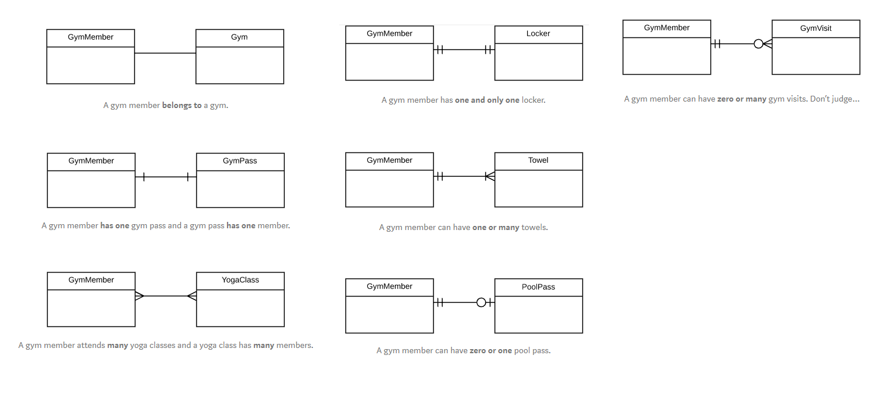
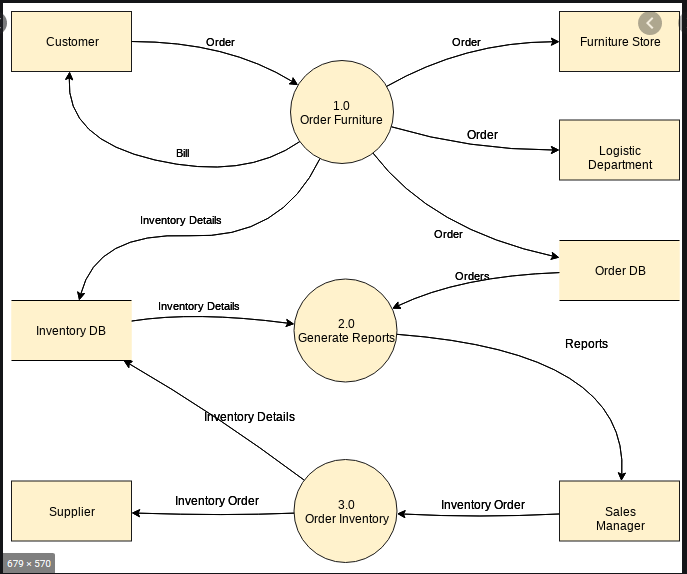
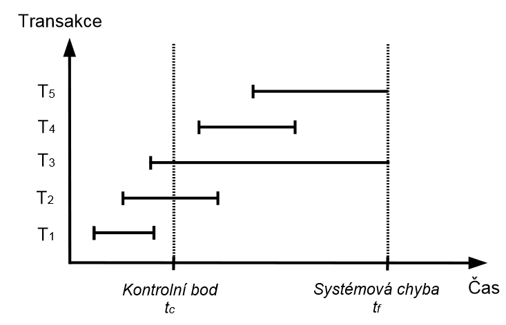

# Databázové a informační systémy

<!-- ----------------------------------------------------------------------------------------------------------------- -->
## 1. Modelování databázových systémů, konceptuální modelování, datová analýza, funkční analýza; nástroje a modely.
Základní pojmy v databázích:
- Entita - objekt reálného světa, jehož vlastnosti chceme evidovat, instance entitního typu
- Typ entity - množina objektů stejného typu charakterizována názvem typu a seznamem atributů
- Atribut - vlastnost entity, hodnota z domény atributu, zadán identifikátorem a datovým typem
- Klíč - podmnožina množiny atributů, podle kterých je entita odlišitelná od ostatních entit stejného typu
- Integritní omezení - omezující podmínky na příslušnost k entitám, hodnoty atributů, definování vazeb
- Doména atributu - obor hodnot atributu, neprázdná množina hodnot
- Vazba - vztah mezi entitními typy, má atributy:
  - Povinnost - povinná, nepovinná
  - Násobnost - 1:1, 1:N, M:N
  - Přenositelnost (transferability) - transferable, non-transferable
- Model - abstraktní obraz budoucí reality, pro pochopení struktury a funkcí systému
- Dynamická analýza - časová následnost operací, stavy databáze a IS

Databázový systém můžeme modelovat třemi datovými modely.
1. Konceptuální model
   - modeluje realitu na logickou úroveň DB
   - je výsledkem datové analýzy
   - nezávislý na implementaci
   - ER model
2. Databázový model
   - modeluje vazby a vztahy na konkrétní tabulky
   - dá se rozdělit na relační a síťový
3. Interní (fyzický) model
   - fyzické uložení dat na paměťovém médiu


### Datová analýza
- Zkoumá objekty realného světa, jejich vlastnosti a vztahy. Ze specifikace požadavků na IS:
  - podstatná jména -> objekty
  - slovesa -> vazby mezi objekty
  - vlastnosti a stavy nalezených objektů -> atributy
- Výsledkem je konceptuální schéma
  - ER Diagram
    - grafické znázornění objektů a vztahů mezi nimi
    
  - Lineární zápis entit
    - popisuje objekty, jejich vlastnosti a vztahy z implementačního pohledu
    - Employee (<u>Id</u>, Name, Surename, Age)
    - Company (<u>Id</u>, Name, EmployeeCount)
    - Works (Company, Employee) 1:N - Lineární zápis vztahů
  - Datový slovník
    - soubor tabulek a pohledů, popisuje logické a úložné struktury databáze.
    - Tabulka obsahující detaily entity, všechny atributy.
    - Typ atributů, velikost, integritní omezení, typ klíče
  - Popis dalších integritních omezení
    - Minimální, maximální hodnoty, atd.
- Datový model - ukazuje způsob, jak jsou data modelována a dotazována, již závislý na SŘBD.

### Funkční analýza
- řeší funkce systému, vyhodnocuje manipulaci s daty v systému
- pomocí DFD (data flow diagram) analyzuje toky dat, základní funkce systému a aktéry, kteří se systémem pracují
- 
- výstupem jsou minispecifikace

**Diagram datových toků (DFD)**
- je grafický nástroj pro modelování vztahů funkcí
- Popisuje algoritmy systému, transformace dat z jedné formy do druhé. 
- Modeluje funkce systému pomocí grafu, používá:
  - Aktéry (terminátory) - externí zdroj nebo cíl dat, objekt vně systému (čtverec/obdélník)
  - Procesy - část systémů měnící vstupy na výstupy (kruh/ovál)
  - Datové paměti - místo uchovávání dat pro pozdější využití
  - Datové toky - přesun dat/informací (šipky)


**Minispecifikace** 
- Podrobná analýza algoritmů elementárních funkcí, tedy procesů nejnižší úrovně DFD.
- Používá se přirozený jazyk, tak aby byla minispecifikace nezávislá na implementaci
- Měla by být ale strukturovaná a používat standardní programové struktury, IF, LOOP
- Pro každou elementární funkce existuje jedna minispecifikace
- popisuje algoritmus, jak probíhá transformace dat
- nezavádí redundantní popisy
```
IF vsechny vyrobky v objednavce jsou rezervovany
THEN posli objednavku k dalsimu zpracovani
ELSE
    FOR EVERY nezarezervovany vyrobek
        zkus najit vyrobek a rezervuj jej
        IF vyrobek neni skladem
        THEN informuj spravce
```

<!-- ----------------------------------------------------------------------------------------------------------------- -->
## 2. Relační datový model, SQL; funkční závislosti, dekompozice a normální formy.
- Relační datový model je způsob uchovávání dat v tabulkách. Tabulky se definují přes relace. 
- Relace je libovolná podmnožina kartézského součinu domén jednotlivých atributů (=tabulka).
- Relační schéma je zápis $R(A_1, \ldots, A_n, D_1, \ldots, D_n)$, kde $R$ je jméno schématu, $A_x$ jména atributů a $D_x$ domény jednotlivých atributů. Relace je typu $R$ (je instancí relačního schématu $R$).
- Schéma relační databáze - konečná množina schémat
- Relační databáze - množina relací ke schématu relační databáze.
- Cizí klíč - atribut relačního schématu obsahující klíč jiného schématu.
- Vazba 1:M je implementována jako vložení primárního klíče schématu s násobností 1 jako cizího klíče schématu s násobností M.
- Vazba M:N je implementována pomocí relačních schémat, které obsahují cizí klíče - primární klíče tříd v asociaci.
- Atribut Y je funkčně závislý na atributu X se značí jako $X \rightarrow Y$
- Atributy $B_1,\ldots ,B_n$ jsou funkčně závislé na atributech $A_1,\ldots ,A_n$, pokud pro libovolné dvě n-tice platí:
  - jestliže jsou hodnoty atributů $A_1,\ldots ,A_n$ totožné, pak jsou totožné i hodnoty atributů $B_1,\ldots ,B_n$, tj. $A_1,\ldots ,A_n \rightarrow B_1,\ldots ,B_n$
- Funkční závislost je triviální, pokud je množina $\{B_1,\ldots ,B_n\}$ podmnožinou $\{A_1,\ldots ,A_n\}$.
- **Uzávěr** $(R^+, \{\}+)$ množiny atributů $\{A_1,\ldots ,A_n\}$ vzhledem k funkčním závislostem $S$ je množina atributů $\{B_1,\ldots ,B_n\}$, pro které platí, že každá relace, která splňuje všechny funkční závislosti $S$ také splňuje $A_1,\ldots ,A_n \rightarrow B_1,\ldots ,B_n$.
  - Uzávěr $X^+$ je množina všech atributů funkčně závislá na atributech množiny $X$.
- **Armstrongovy axiomy** jsou úplná (dovolují odvodit z dané množiny $F$ všechny závislosti patřící do $F+$) a bezesporná (dovolují z $F$ odvodit pouze závislosti patřící do $F+$) pravidla pro získání uzávěrů:
  - Je-li $X \rightarrow Y$ a $Y \rightarrow Z$, pak $X \rightarrow Z$ (tranzitivita)
  - Je-li $X \rightarrow Y$ a $X \rightarrow Z$, $X \rightarrow YZ$ (sjednocení)
  - Je-li $X \rightarrow Y$ a $WY \rightarrow Z$, pak $XW \rightarrow Z$ (pseudo-tranzitivita)
  - Je-li $X \rightarrow YZ$, pak $X \rightarrow Y$ a $X \rightarrow Z$ (dekompozice) 
- Elementární závislost je taková závislost, které má na pravé straně pouze jeden atribut.
- Neredundantní pokrytí je takové pokrytí, které neobsahuje redundantní závislosti. Závisí na pořadí odebírání neredundantních závislostí. Pokud vycházíme z $F+$, nemusí být podmnožinou $F$.
- Minimální pokrytí je pokrytí, v jehož závislostech neexistují žádné redundantní atributy. Pro získání minimálního pokrytí je nutné odstranit nejprve redundantní atributy a poté závislosti.
- **Normální formy**
  - 1NF - všechny atributy jsou atomické.
  - 2NF - 1NF a všechny neklíčové atributy jsou závislé na celém klíči.
  - 3NF - 2NF a žádná množina neklíčových atributů není závislá na jiné množině neklíčových atributů, dosažení pomocí algoritmu syntézy (nová relace pro každou funkční závislost, následné spojování do větších celků).
  - BCNF - levá část každé funkční závislosti musí obsahovat klíč (a všechny jsou tedy nad-klíčem), získání pomocí algoritmu dekompozice.
- Relační algebra je jazyk vysoké úrovně, který nepracuje s jednotlivými n-ticemi, ale s celými relacemi. Operátory relační algebry jsou aplikovány na relace a výsledkem jsou opět relace. Jelikož relace jsou množiny, lze využít množinové operátory a navíc operace specifické pro dotazování nad relacemi:
  - Sjednocení $\cup$
  - Průnik $\cap$
  - Rozdíl $-$
  - Kartézský součin $\times$
  - Selekce (restrikce) - výběr n-tic z původní relace na základě logické podmínky -- $\delta_\textit{podminka} (\textit{Relace})$
  - Projekce - výběr sloupců (duplicitní záznamy jsou odstraněny) -- $\pi_\textit{sezanm atributů} (\textit{Relace})$
  - Přirozené spojení $\bowtie$ -- z $R\times S$ se se vyberou pouze řádky se stejnými hodnotami u stejnojmenných atributů u obou relací
  - Theta spojení-- $R \bowtie_\Theta S$, z $R\times S$ se se vyberou pouze řádky odpovídající podmínce $\Theta$

### SQL
SQL (Structured Query Language) je strukturovaný dotazovací jazyk, který je používán pro práci s daty v relačních databázích
- JDD - Jazyk pro definici dat (`CREATE/ALTER/DROP TABLE, SCHEMA, INDEX`)
- JMD - Jazyk pro manipulaci s daty (`SELECT,FROM,GROUP BY, ORDER BY, HAVING, WHERE, INSERT, DELETE, UPDATE, CREATE VIEW`)
- Možnost definice přístupových práv (`GRANT, REVOKE`)
- Možnost definice integritních omezení (`ALTER TABLE ADD CONSTRAINT`)
- Řízení transakcí (`BEGIN TRANSACTION, COMMIT, ROLLBACK, SAVEPOINT`)


### Funkční závislosti, dekompozice a normální formy
- Uvedeno v úvodu sekce
- postup datové analýzy s automatickým navržením struktury databáze
  1. Ze zadání zjístíme co je třeba v databázi evidovat
  2. Funkční analýzou určíme závislosti (vztahy) mezia atributy
  3. Vytvoříme jednu velkou tabulku, obsahující všechny atributy
  4. Pomocí funkčních závislostí provedeme dekompozici velké relace na menší relace
- Dekompozice je rozklad relačního schématu na menší relační schéma, bez narušení redundance databáze
  - Dekompozice relačního schématu $R(A,f)$ je množina relačních $RO={R_1(A_1,f_1), R_2(A_2,f_2), \ldots}$, kde $A = A_1 \cup A_2 \cup \ldots$
  - zachování informace
    - $R_0 = {R_1(B), R_2(C)}$, dekompozice relačního schématu $R(B \cup C)$ musí platit $B \cap C \rightarrow B - C \vee C \cap B \rightarrow C - B$
  - zachování funkčních závislostí
    - $F^+ = (F(B)\cup F(C))^+$
    - každá funkční závislost je obsažena alespoň v jedné z rozložených tabulek
    - UDELAT PRIKLAD

<!-- ----------------------------------------------------------------------------------------------------------------- -->
## 3. Transakce, zotavení, log, ACID, operace COMMIT a ROLLBACK; problémy souběhu, řízení souběhu: zamykání, úroveň izolace v SQL.
- Korektní stav databáze - výsledek operací je platný v reálném světě
- Konzistentní stav databáze - v databázi neexistují výjimky z daných integritních omezení
- Sériový a serializovatelný plán
  - Sériový plán jsou transakce provedené za sebou.
  - Serializovatelný plán - Plán vykonání 2 transakcí je korektní tehdy a jen tehdy pokud je serializovatelný, tj. je ekvivalentní s výsledkem libovolného sériového plánu. 
    - dva plány jsou ekvivalentní pokud podávají stejné výsledky.

### Transakce
- logická (nedělitelná) jednotka práce s databází, začíná operací `BEGIN TRANSACTION` a končí provedením operace `COMMIT` nebo `ROLLBACK`. 
- Jejím úkolem je převést databázi z korektního stavu do dalšího korektního stavu. Musí splňovat vlastnost ACID:
  - A Atomičnost - transakce musí být atomická (provede se všechno nebo nic)
  - C Korektnost - DB je převedena z jednoho do druhého korektního stavu, v průběhu transakce nemusí být v korektním stavu
  - I Izolovanost - změny provedené jednou transakcí jsou pro ostatní transakce viditelné až po potvrzení
  - D Trvalost - změny se po potvrzení stanou trvalými i po pádu systému
- `COMMIT` - Úspěšné ukončení transakce, všechny změny jsou trvale uloženy.
- `ROLLBACK` - Neúspěšné provedení transakce, databáze může být v nekorektním stavu, a všechny změny v rámci transakce musí být zrušeny (po poslední commit point).
  - pro podporu operace ROLLBACK má systém k dispozici log nebo journaln a disku kde jsou zaznamenány detaily o všech provedených operacích.
  - V případě ROLLBACK operace je systém na základě záznamů v logu schopen vrátit hodnoty příslušného záznamu na původní hodnoty
- Commit Point - Všechny změny provedené v rámci transakce jsou trvale uloženy. Všechny adresace (např. nastavené pomocí kurzorů) a zámky jsou uvolněny.
- Zotavení - obnovení databáze do stavu před vznikem chyby, výsledkem musí být korektní stav databáze.
  - lokální chyba - chyba v dotazu, přetečení hodnoty atributu
  - globální chyba - sestémová chyba, výpadek proudu, uložného média
- UNDO - přesný stav transakce přerušené chybou není znám, musí být zrušena (ztráta obsahu paměti).
- REDO - transakce byla provedena, ale změny nebyly z vyrovnávací paměti přeneseny, musí být přepracována.

**Kontrolní body**
- kontrolní body jsou vytvářeny např. po určitém počtu záznamů, které byly zapsány do logu a zahrnují
  - zápis obsahu vyrovnávací paměti na disk
  - zápis záznamu o kontrolním bodo do logu

 - T3 a T5 musí být zrušeny
 - T2 a T4 musí být přepracovány
 - Transakce T1 je v pořádku

**Algoritmus zotavení**
1. Vytvoří se 2 seznamy transakcí UNDO a REDO
2. Do UNDO se vloží všechny transakce, které nebyly úspěšně dokončeny před posledním kontrolním bodem, REDO je prázdné.
3. Začnou se procházet záznamy v logu, od záznamu posledního kontrolního bodu. Pokud je pro transakci T nalezen v logu COMMIT, přesune se T z UNDO do REDO seznamu.
4. Systém prochází log zpětně a ruší aktualizace transakcí z UNDO seznamu
5. Systém prochází logem dopředu a přepracovává transakce z REDO seznamu

- Zotavení po chybě média - Začíná obnovením ze záložní kopie (dump souborů). Procházen log, všechny transakce dokončené po času vytvoření zálohy jsou přepracovány.
- Záchranné body - Rozdělují transakci na menší části, není ekvivalentem COMMIT. Jde použít rollback k danému bodu, po ukončení transakce, jsou automaticky všechny body zrušeny.

### Techniky zotavení
**Odložená aktualizace (NO-UNDO/REDO)**
- Neprovádí aktualizace logu ani databáze až do potvrzení transakce, mezitím jsou všechny aktualizace jsou v paměti. 
- Po potvrzení transakce je aktualizace zaznamenána v logu a následně v DB. 
- Pokud transakce selže, není nutné provést UNDO. 
- REDO se provede, pokud je záznam v logu, ale změna není v DB. 
- Do logu jsou zapsány nové hodnoty, což umožní provést REDO.
- V praxi se používá, když systém provádí krátké transakce a transakce mění pouze málo položek (limit velikost paměti)

**Okamžitá aktualizace (UNDO/NO-REDO)**
- Aktualizace logu a databáze po každé aktualizaci transakce (nejprve log, poté databáze). 
- Selhání před dosažením potvrzovacího bodu znamená UNDO. 
- Do logu se ukládají původní hodnoty, což umožní po zotavení provést UNDO. 
- Velký počet zápisů do DB, ale nedojde k přetečení vyrovnávací paměti.

**Kombinovaná technika (UNDO/REDO)**
- Aktualizace jsou zapsány do logu po potvrzení. Změny zapsány do DB v určitých časových intervalech - kontrolních bodech. 
- Kontrolní body jsou vytvářeny např. po určitém počtu záznamů  (Zápis obsahu vyrovnávací paměti do DB nebo Zápis záznamu o kontrolním bodu do logu.) 
- Záznam o kontrolním bodu obsahuje všechny transakce vykonané v době vytvoření kontrolního bodu a transakce ukončené před kontrolním bodem, které ale nebyly zapsány do DB v rámci předchozího k. bodu. 
- V praxi nejpoužívanější technika

**Metoda stínového stránkování**
- Před zahájením transakce jsou původní data zálohována ve stínové tabulce
- Při prerušení nebo selhání jsou tyto data obnovena
- Při úspěšné transakci se uvolní záloha ve stínové tabulce

### Souběh
- Souběh je přístup několika aktérů k jednomu zdroji současně (více transakcí v jednom čase).
- Plán je posloupnost operací transakcí. Pokud jsou plány prováděny souběžně mluvíme o souběžném (paralelním) plánu.
- Mohou nastat 3 hlavní problémy
  - Ztráta aktualizace - 2 transakce provádí aktualizaci stejných dat, poslední aktualizace bude uložena ale předchozí bude ztracena.
  - Nepotvrzená závislost - Jedna transakce přečte data, která byla změněna druhou transakcí, ale ještě nebyla potvrzená a tato druhá transakce může být navíc vrácena zpět pomocí ROLLBACK
  - Nekonzistentní analýza - Jedna z transakcí pracuje s nekonzistentní databází. První transakce načte data, druhá transakce tyto data změní, a až teď první transakce provede operace nad načtenými daty, které již nejsou aktuální.
- Konflikty čtení a zápisu (Uvažujeme transakce $A$, $B$ a entici $t$), nastávají, když 2 transakce chtějí číst nebo zapisovat stejnou entici:
  - RR - $A$ a $B$ čtou $t$, není problém.
  - RW
    - $A$ čte $t$, $B$ chce zapsat $t$, nastává problém nekonzistentní analýzy
    - $A$ načte $t$, $B$ změní $t$, $A$ znovu načte $t$, problém neopakovatelného čtení.
  - WR - $A$ zapíše $t$, $B$ čte $t$ ještě nepotvrzené transakcí $A$, problém nepotvrzené závislosti. (Pokud $A$ provede ROLLBACK jedná se o problém špinavého čtení)
  - WW
    - $A$ zapíše $t$, $B$ chce taky zapsat $t$, nastává problém ztráty aktualizace pro transakci $A$, a problém nepotvrzené závislosti pro transakci $B$.
    - Pokud $B$ zapíše $t$ po $A$ jedná se o špinavý zápis.

### Zamykání
Využívá většina DBS. Předpokládá se, že transakce se budou ovlivňovat. Systém spravuje jednu kopii dat a transakcím přiřazuje zámky. Pokud tedy chce transakce provádět operace nad daty potřebuje získat zámek, udělující ji přístup a zákaz všem ostatním transakcím. Typy zámku:
- Výlučný zámek - zámek pro zápis - $X$
- Sdílený zámek - zámek pro čtení - $S$

Pokud transakce $A$ drží výlučný zámek $X$ na entici $t$, pak požadavek paralelní transakce $B$ na zámek libovolného typu na stejnou entici není proveden okamžitě, až po uvolnění zámku $X$ transakcí $A$.

Pokud transakce $A$ drží sdílený zámek $S$ na entici $t$, pak pokud:
- paralelní transakce $B$, požaduje výlučný zámek $X$, tak tomuto požadavku není vyhověno ihned.
- paralelní transakce $B$, požaduje sdílený zámek $S$, tak tomuto požadavku je vyhověno a obě transakce mají $S$ zámek.

Zámky jsou většinou přidělovány implicitně pomocí zamykacího protokolu. Uzamykací protokol probíhá následovně:
- Transakce chce získat přístup k entici, požádá o sdílený zámek S na tuto entici. 
- Transakce, která chce aktualizovat (UPDATE, INSERT, DELETE) musí požádat o výlučný zámek $X$.
- Pokud stejná transakce již drží zámek $S$, tak je změněn na $X$. Pokud zámek nemůže být udělen tak transakce přejde do stavu čekání. 
- Čeká dokud není zámek uvolněn. Transakce čekají ve frontě. Výlučné i sdílené zámky jsou uvolněny na konci transakce.

Může nastat situace kdy dvě nebo více transakce čekají na uvolnění zámků držených jinou transakcí *deadlock*, ten se dá řešit těmito způsoby:
- Detekce uváznutí - nastavení časových limitů čekání, překročení limitu znamená deadlock
- Detekce cykly v grafu *wait-for*. Zaznamená se, které transakce na sebe čekají, jedna je vybrána a zrušena *ROLLBACKem*, následně je přepracována nebo vyhozena výjimka.
- Prevence pomocí časových razítek - Každé transakci se přidělí časové razítko startu, pokud $A$ požaduje zámek na entici, která je již uzavřena a zámek drží $B$ tak 2 možnosti:
  - WAIT-DIE - pokud je $A$ starší než $B$, tak $A$ čeká, pokud je $A$ mladší než $B$, transakce $A$ je zrušena pomocí ROLLBACK a spuštěna znova
  - WOUND-WAIT - pokud je $A$ mladší než $B$, přejde do stavu čekání. Pokud je $A$ starší, transakce $B$ je zrušena ROLLBACK a spuštěna znova
- Transakce spuštěna znovu má své původní časové razítko, nevýhodou je teoreticky velká počet operací ROLLBACK

- Dvoufázové zamykání vždy zaručuje, že plán bude serializovatelný. Transakce musí požádat o zámek na objekt, před tím, než chce nad tímto objektem provést nějakou operaci (Fáze 1 - požadavek). 
- Po uvolnění zámku nesmí již transakce požadovat další zámek (Fáze 2 - uvolnění).

**Správa verzí**
- Předpokládáme, že se nebudou transakce ovlivňovat. Vytváří se kopie a systém sleduje, která verze má být viditelná pro ostatní v závislosti na izolaci.
- Další techniky řízení souběhu jsou Časová razítka a Validace.

### Úrovně izolace transakce
- Garantuje izolaci ve smyslu ACID. Úroveň
-  izolace je možnost nastavení poměru propustnosti / míry izolace transakce. 
-  Vyšší úroveň značí vyšší míru izolace ale menší propustnost
-  RU < RC < RR < SR.
   -  READ UNCOMMITED - špinavé čtení, čte nepotvrzená data
   -  READ COMMITED - čisté čtení, čte potvrzená data
   -  REPEATABLE READ - čisté opakovatelné čtení, možný výskyt fantomů
   -  SERIALIZABALE - čisté opakovatelné čtení, bez fantomů
- Výskyt fantomů je situace, kdy $A$ načte data, $B$ získá zámek $X$ vloží nový záznam, uvolní zámek, $A$ načte znovu data, ale data jsou inkonzistentní.

| Izolace           | Špinavé čtení | Neopakovatelné čtení | Výskyt fantomů |
| :---------------- | :-----------: | :-------------------: | :-----------: |
| READ UNCOMMITED   | Ano           | Ano                   | Ano           |
| READ COMMITED     | Ne            | Ano                   | Ano           |
| REPEATABLE READ   | Ne            | Ne                    | Ano           |
| SERIALIZABALE     | Ne            | Ne                    | Ne            |

<!-- ----------------------------------------------------------------------------------------------------------------- -->
## 4. Procedurální rozšíření SQL, PL/SQL, T-SQL, triggery, funkce, procedury, kurzory, hromadné operace.
Procedurální rozšíření kombinují procedurální logiku a SQL, což minimalizuje množství přenášených dat. Kód může být sdílen mezi aplikacemi. Nezávislost na OS platformě (ne mezi DBS).
Krom základních SQL příkazů, obsahuje PL/SQL a T-SQL také triggery, funkce, procedůry a kurzory.
- Vázané proměnné umožňují cachevání proměnných při mnohonásobném vykonávání příkazu

### PL/SQL
Statické PL/SQL je přímo volatelné (SELECT, INSERT, UPDATE, DELETE, MERGE, LOCK TABLE, COMMIT, ROLLBACK, SAVEPOINT, SET TRANSACTION)

Dynamické SQL umožňuje sestavit a volat jakýkoliv SQL příkaz na jaký má uživatel za běhu právo. Představuje nebezpečí pro SQL injection. Volání pomocí EXECUTE IMMEDIATE (Vytváření tabulek, JDD operace).

- Anonymní procedůry - spouštěny přímo z SQL souboru nebo konzole, pomalejší než uložené procedůry.
- Pojmenované procedůry - rychlejších než anonymní, kompilovány pouze jednou. Volány pomocí EXECUTE, CALL atd.
- Funkce oproti procedůrám vrácejí určitý výsledek
- Trigger je vlastně procedůra 
  - V trigger mámě většinou k dispozici reference na tabulku *NEW*, obsahující nová data a *OLD*, obsahující stará data
- Kurzor je ukazatel na řádek, který byl vrácen ve víceřádkovém výběru, SQL dotazu
  - PL/SQL podporuje implicitní kurzor v cyklu FOREACH
  - v T/SQL se musí kurzor ručně alokovat i uvolňovat

Typické rysy:
- Typy řádku nebo atributu,  `%type` a `%rowtype`
- Deklarace proměnných v declare bloku nebo as/is bloku v procedurách
- CREATE OR REPLACE – pro vytvoření nebo update procedury/funkce/triggeru/view
- Explicitní kurzor – CURSOR name IS SELECT ..., open, fetch, close
- Implicitní kurzor v cyklu FOR , FOR ... in (select ...)
- Anonymní procedura (blok) - DECLARE ... BEGIN ... EXCEPTION ... END
- Pojmenovaná procedura - CREATE OR REPLACE PROCEDURE <name> (<params>) AS <variables> BEGIN <commands> END
- Funkce - CREATE OR REPLACE FUNCTION <name> (<params>) RETURN <rettype> AS <variables> BEGIN <commands> END
- Trigger - blok spouštěn v závislosti na DML příkazu (INSERT, UPDATE, DELETE)
  - CREATE TRIGGER <name> [BEFORE|AFTER|INSTEAD OF] [INSERT|UPDATE|DELETE] OF <col> ON <table> [FOR EACH ROW [WHEN ()]] BEGIN <commands> END
- Kurzor - pomocná proměnná pro procházení výsledků příkazů (foreach)
  - DECLARE CURSOR *cu* IS SELECT x FROM a; BEGIN FOR c IN *cu* LOOP ... END LOOP; END;
- Hromadné operace – Operace nad velkým množstvím dat (BULK COLLECT (se SELECT INTO), FORALL (iterace dat))

### T-SQL
Typické rysy:
- Nemá Operátor `%type` a `%rowtype`
- Proměnné deklarované pomocí klíčového slova DECLARE, a @ před názvem, hodnota se nastaví buď v SELECT nebo pomocí SET
- Jediný cyklus WHILE
- Změna procedury pomocí ALTER
- Funkce v T-SQL jsou omezeny 
  - Nelze použít TRY, CATCH syntaxe
  - Nelze měnit data - Řešením je použít výstupní parametr u procedur
- Kurzor pouze explicitní, DECLARE name CURSOR FOR SELECT (OPEN, FETCH (NEXT), CLOSE, DEALLOCATE)
- Dynamické SQL pomocí `sp_executesql`
- CREATE [ OR ALTER ] { PROC | PROCEDURE } [schema_name.] procedure_name 
- BEGIN TRANSACTION, COMMIT TRANSACTION, ROLLBACK TRANSACTION
- CREATE TRIGGER [ schema_name . ] trigger_name ON { table | view }
- BULK INSERT 


<!-- ----------------------------------------------------------------------------------------------------------------- -->
## 5. Základní fyzická implementace databázových systémů: tabulky a indexy; plán vykonávání dotazů.
Definuje datové struktury pro základní logické objekty a řeší uložení dat na nejnižší úrovni. 
- Tabulky
- Indexy
- Materializované pohledy
- Rozdělení dat (data partitioning)

- CREATE TABLE s PRIMARY KEY vytvoří v Oracle DB Haldu a v SQL Server shlukování záznamů.
- Datové struktury se skládají z různého počtu stránek (resp. uzlů u stromových struktur), jsou realizovány tak, aby byly operace vyhledávání, vkládání, editace a mazání co nejefektivnější
- pro rechlé vyhledávání, které předchází editaci i mazání je nutno udržovat datovou strukturu setřízenou
  - toto zpomaluje operaci vkládání, kdy se musí posouvat záznamy
- BLOK je nejmenší jednotka se kterou SŘBD manipuluje při zápisu a čtení dat z disku
  - obvykle 4 nebo 8 kB
- Stránka - nejmenší jednotka, se kterou pracuje správce paměti
- Datový soubor - fyzický prostor na disku s daty
- 2 typy přístupů na stránky: (cache hit, pokud je stránka zrovna v paměti, jinak cache miss)
  - Logický přístup - Přístup ke stránce libovolné datové struktury
  - Fyzický přístup - Načtení nebo zápis stránky na disk

### Typy tabulek
- každý záznam v tabulce ma přiřazené unikátní číslo ROWID

**Tabulka typu halda** 
- Stránkované persistentní pole.
- Záznamy nejsou fyzicky mazány, jsou pouze označeny jako smazané (pro skutečné smazání musí být proveden shrinking). 
- Při vkládání je záznam umístěn na první volnou pozici nebo na konec pole. 
- Neefektivní vyhledávání ($O(n)$) – nelze se spoléhat na uspořádání záznamů v tabulce. Efektivní z pohledu využití místa a operace INSERT ($*O(1)$).

**Shlukování záznamů (data clustering)** 
- Záznamy jsou v datovém souboru seřazeny podle zvoleného klíče, pro implementaci bývá využita nějaká varianta B-stromu. 
  - Záznamy se stejnou hodnotou atributu jsou uloženy ve stejném nebo alespoň blízkém bloku
- Hodí se v případech, kdy je třeba získat hodnoty neklíčových atributů. 
- Operace INSERT má zhoršený  výkon – data se musí zatřizovat. 
- (Oracle: indexed organized table (IOT), SQL Server: clustered index)

**Zhmotněné pohledy**
- Nejedná se přímo o fyzické tabulky, ale spíše uložené výsledky dotazů
- jsou vyhodnocovány při dotazu na data

- Hašovaná tabulka - záznamy se stejnou hašovanou hodnotou jsou uloženy ve stejném nebo velmi blízkém bloku.
- 
### Indexy
- Index je databázová konstrukce sloužící ke zrychlení vyhledávacích a dotazovacích procesů využívající neklíčových atributů jako klíčů v nové stromové struktuře. Nejrozšířenější typ indexu využívá B-strom, dále pak existuje:
  - Složený index – klíčem je více než jeden atribut (při dotazu na pod-klíč dochází k sekvenčnímu průchodu)
  - Hash table
  - Bitmapový index – ke každému záznamu vytvořen bitový vektor, vhodné pro malé domény a logické operace
  - Shlukovaný index (Cluster index) – pokud se pro atribut často používá JOIN; diskový blok pak obsahuje jak záznam z řídící tabulky, tak závislé záznamy.
- Databázové konstrukce sloužící 


### B-Strom
- B+ strom všechny hodnoty jsou až v listech
- uzly strmu mohou obsahovat n až 2n položek
- složitost vyhledávání max $\log_n N$, kde N je počet položek ve stromu
- B-strom řádu `n` je (2n-1)-ární strom, splňující
  - každý uzel obsahuje nejvýše `2n` položek
  - jaždý uzel, s výjimkou kořene obsahuje alespoň n položek
  - každý uzel je buď listový nebo má `m+1` následovníků, kde `m` je počet položek v uzlu
- Kliče jsou v uzlu seřazeny od nejmenšího po největší

### Vykonávání dotazů v databázových systémech; plán vykonávání dotazů
- Plán vykonávání dotazů vybírá optimalizátor a lze zlepšit pomocí: parametrizovaných dotazů, hromadné operace nad velkými daty, nastavením transakce nebo danou fyzickou implementací. 
- Vykonání dotazu probíhá následovně:
  1. Převod dotazu do interní formy
     - Eliminace syntaxe SQL
     - Nahradíme pohled jeho definicí
     - Interní forma je nejčastěji druh dotazovacího stromu
  2. Převod do kanonické formy
     - Odstranění povrchních rozdílů a nalezení efektivnějšího tvaru než nabízel původní dotaz
     - Použiti transformačních pravidel, převod mezi ekvivalentními dotazy
  3. Výběr nízkoúrovňových procedůr
     - optimalizátor se rozhoduje jak bude dotaz vykonán
     - zvažuje se existence indexů, distribuce hodnot a shlukování uložených dat
  4. Vygenerování plánu dorazu a výběr nejlevnějšího
     - Každému plánu je přiřazena cena (I/O Cost, CPU Cost)
     - Je vybrán nejlevnější plán
- Logický plán vykonání dotazu - strom pro vykonání dotazu s použitím relační algebry.
- Fyzický plán vykonání dotazu - vybírá konkrétní algoritmy implementující jednotlivé operátory logického plánu.
- Přístup k celé tabulce, prohledávání bez indexu (sekvenční)- při prohledání celé tabulky, bez restrikce, nebo s restrikcí na neindexovaný atribut.
- Přístup přes index při
  - Unique Scan – při hledání podle indexovaného atributu
  - Range Scan – hledání více záznamů pomocí indexu
  - ROWID – přístup k jedinému záznamu
- Problém složeného indexu - pokud vytvoříme index s např. 2 atributy, musíme definovat oba při vyhledání, jinak dojde k sekvenčnímu průchodu tabulkou. Navíc složité indexy zabírají více místa.

<!-- ----------------------------------------------------------------------------------------------------------------- -->
## 6. Objektově‐relační datový model a XML datový model: principy, dotazovací jazyky.


<!-- ----------------------------------------------------------------------------------------------------------------- -->
## 7. Datová vrstva informačního systému; existující API, rámce a implementace, bezpečnost; objektově-relační mapování.


<!-- ----------------------------------------------------------------------------------------------------------------- -->
## 8. Distribuované SŘBD, fragmentace a replikace.


\newpage
